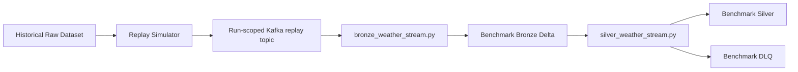
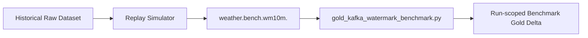
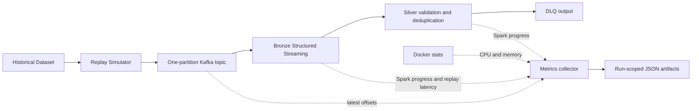

# Reproducible Correctness Benchmarks

This document covers the two correctness scenarios supported by
`benchmark/run_benchmark.py`. Historical runtime observations supplied during
development remain useful references; each new execution records its own
configuration and result.

## Status vocabulary

Keep these facts separate for every run:

- **Implementation:** the source code and intended behavior exist.
- **Runtime validation:** the component was executed and observed.
- **Reproducibility:** another developer can repeat the run from the repository
  and the documented commands.
- **Persisted result evidence:** the run's manifest, input summary, and checker
  result are stored under `results/benchmarks/`.

The prior B0 and Kafka watermark runs were runtime-verified. Before this
framework, their result artifacts were not persisted. The historical values
below are regression references, not universal pass thresholds.

## Existing benchmark and diagnostic code

| File | Classification | Use |
|---|---|---|
| `spark/jobs/bronze_weather_stream.py` | LIVE / reusable benchmark job | Production Bronze job; benchmark settings supply an isolated topic, path, checkpoint, and bounded `availableNow` trigger. |
| `spark/jobs/silver_weather_stream.py` | LIVE / reusable benchmark job | Production Silver and DLQ jobs; benchmark settings supply isolated inputs, outputs, checkpoints, and a bounded trigger. |
| `spark/jobs/check_benchmark_bronze.py` | CHECKER | Inspects Bronze records and simulator fault metadata. |
| `spark/jobs/check_benchmark_silver.py` | CHECKER | Runs the B0 count, DLQ, deduplication, and quality assertions and writes `result.json`. |
| `spark/jobs/check_watermark_benchmark.py` | DIAGNOSTIC CHECKER | Inspects the earlier Silver watermark experiment. |
| `spark/jobs/check_replay_event_lag.py` | DIAGNOSTIC | Estimates event-time lag from replay arrival ordering. |
| `spark/jobs/gold_watermark_benchmark.py` | DEPRECATED EXPERIMENT | Reads physical Silver Delta file order. It is invalidated as a Kafka arrival-order watermark benchmark. |
| `spark/jobs/gold_kafka_watermark_benchmark.py` | REUSABLE BENCHMARK | Current Kafka-direct Gold watermark implementation. |
| `spark/jobs/check_gold_watermark_benchmark.py` | CHECKER | Requires the Kafka watermark scenario and run identity, reads that run's Kafka input and derived Gold path, and writes `result.json`. |
| `spark/jobs/init_benchmark_bronze.py` | ONE-OFF INITIALIZER | Legacy helper; the run-scoped B0 runner does not use it. |

## B0 correctness

B0 validates that the production Bronze and Silver jobs preserve and classify
the simulator's messages correctly.



The Kafka topic is unique to the run. Bronze and Silver reuse the production
jobs with run-scoped paths and checkpoints. The live `weather.raw` topic,
live Delta paths, and live checkpoints are not used.

The B0 checker records and asserts:

- source records, Kafka messages, and Bronze records;
- Silver and DLQ records;
- injected and removed duplicates;
- generated and DLQ-routed invalid events;
- NORMAL, LATE, and OUT_OF_ORDER counts;
- duplicate `event_id` groups and Silver quality violations;
- Bronze/Silver/DLQ/duplicate conservation.

The historical B0 reference produced 10,195 Bronze records, 9,903 Silver
records, 97 DLQ records, and 195 removed duplicates. It observed 8,892 NORMAL,
490 LATE, and 521 OUT_OF_ORDER Silver records, zero duplicate groups, and zero
quality violations. A changed result is measured and reported; these counts
are not hard-coded as pass criteria.

## Silver watermark diagnostic

The Silver watermark experiment observed 953 late events generated, 953
accepted, and none dropped. It remains a verified diagnostic and a useful
negative finding. Silver's `dropDuplicatesWithinWatermark` is not the final
general late-event rejection benchmark.

## Delta-order Gold experiment

`gold_watermark_benchmark.py` consumed Silver Delta files using
`maxFilesPerTrigger`. Physical file order does not preserve original Kafka
arrival order. Its result (97 accepted observations; 9,903 dropped, including
940 late and 8,962 normal) is therefore methodologically invalidated and
superseded. Keep it for historical context; do not use it to assess the final
Kafka watermark behavior.

## Kafka-direct Gold watermark

The current watermark scenario sends the replay directly to Kafka and lets
`gold_kafka_watermark_benchmark.py` consume that topic:



This path measures event-time window watermark handling, normal-event
preservation, late-event acceptance/rejection, and duplicate Gold keys. It
does not include the B0 Bronze → Silver → DLQ stages.

The established configuration is 10,000 source records, a requested replay
rate of 1,000 messages/second, zero duplicate/invalid/out-of-order rates, a
10% late rate, 4,000-event late delay, seed 42, a 10-minute watermark,
one-hour windows, and 500 Kafka offsets per trigger. A historical run accepted
9,103 of 10,000 observations, preserved all 9,047 NORMAL observations, dropped
897 of 953 LATE observations (94.12%), and produced zero duplicate Gold keys.
The measured late-drop rate is recorded, never required to equal 94.12%.

## Isolation and topic strategy

`spark/jobs/benchmark_config.py` owns scenario names, defaults, topic names,
and run-scoped resource paths. A run ID is used in its topic, Delta paths, and
checkpoints.

Topics use the pattern `weather.bench.<scenario>.<run_id>` and one partition.
Run-scoped topics prevent old messages from contaminating a new run. One
partition also preserves the simulator's overall arrival order for the
watermark scenario. This is a correctness setup; it does not represent a
multi-partition throughput or scalability test. Topics are retained and never
deleted by the runner.

Delta outputs are isolated under:

```text
/opt/project/data/benchmark/runs/{b0|wm10m}/{run_id}/
```

Checkpoints are isolated under:

```text
/opt/project/data/checkpoints/benchmark/runs/{b0|wm10m}/{run_id}/
```

The final watermark checker requires `BENCHMARK_SCENARIO` and `RUN_ID`.
Paths are derived from those values and any conflicting explicit path fails
fast. It cannot silently fall back to the old Delta-order Gold directory.

## Run a benchmark

From Windows PowerShell at the repository root:

```powershell
.\.venv\Scripts\Activate.ps1
docker compose up --build -d broker spark-master spark-worker
python -m pip install -r producer/requirements.txt
python benchmark/run_benchmark.py --scenario b0
python benchmark/run_benchmark.py --scenario wm10m
```

The runner generates a fresh timestamped run ID unless `--run-id` is supplied.
It creates a new one-partition topic and does not reuse or delete prior topics,
paths, or checkpoints. It refuses a dirty code tree so the manifest identifies
the tested commit; uncommitted result JSON from the immediately preceding run
is allowed so both scenarios can be executed before committing their evidence.

Use `--source`, `--max-source-events`, `--rate`, and `--seed` to select a
different bounded replay input. The simulator's actual generation rate is a
load-generation metric only.

The runner uses Spark's `availableNow` trigger for bounded Bronze/Silver
benchmark jobs. Live jobs keep their existing continuous-trigger behavior.
Delta Spark 4.0.0 is pinned for the Spark 4.x image; the same version is used
for its Python package and the Maven artifact resolved by `spark-submit`. Spark
resolves the Delta and Kafka connector packages into `/tmp/spark-ivy`, which is
writable by the container user.

## Run artifacts

Each run writes:

```text
results/benchmarks/{b0|wm10m}/{run_id}/
  manifest.json
  simulator.json
  result.json
```

- `manifest.json` records scenario, run ID, creation/completion times, Git
  commit, input source and limit, topic and partition count, fault settings,
  watermark/window/offset settings, all output/checkpoint paths, software
  versions, artifact paths, status, and result metrics.
- `simulator.json` records actual source/Kafka counts, injected fault counts,
  requested rate, observed generation rate, and producer flush status. The
  checkers use it as the run's input reference.
- `result.json` records checker metrics, named PASS/FAIL assertions, paths,
  scenario, run ID, and Git commit.

Only these small JSON artifacts are stored in the repository. Delta data and
checkpoints remain in the Docker named volume and are not committed.

Inspect recent runs with:

```powershell
Get-ChildItem .\results\benchmarks\b0 -Directory |
  Sort-Object LastWriteTime -Descending |
  Select-Object -First 1
Get-ChildItem .\results\benchmarks\wm10m -Directory |
  Sort-Object LastWriteTime -Descending |
  Select-Object -First 1
```

## Load generation versus throughput benchmarking

The replay simulator's earlier approximately 1,019 messages/second result was
only a load-generation measurement. It did not measure Spark/Kafka throughput.
The `throughput` scenario below measures the streaming pipeline separately.

## Performance Instrumentation

The fixed baseline runs the run-scoped Kafka topic through the production
Bronze, Silver, and DLQ streaming jobs. Gold is excluded so this first
measurement isolates Kafka ingress, Bronze writes, Silver validation, and
deduplication from aggregation state. Silver's 10-minute watermark and
`dropDuplicatesWithinWatermark` semantics remain unchanged. All simulator fault
rates are zero.



### Fixed configuration

Every run records observed Compose and Spark Master configuration in
`manifest.json`:

- Kafka 4.3.1, one partition, replication factor 1.
- One Spark 4.0.4 worker with 4 advertised cores and 4,096 MB worker memory.
- Bronze and Silver/DLQ run as two concurrent Spark applications. Each requests
  at most one executor core and 1,024 MB executor memory; each uses one SQL
  shuffle partition and a one-second processing-time trigger. The manifest
  captures the active applications reported by the Spark Master REST endpoint.
- Delta Spark 4.0.0. The benchmark uses client deploy mode and the existing
  writable `/tmp/spark-ivy` dependency cache.
- `docker inspect` reports no per-container CPU or memory hard limit for the
  worker or broker. Resource JSONL preserves Docker's reported memory
  denominator and separately records a configured container limit as `null`.

This is a single-worker capacity baseline. It does not compare partition counts,
Spark core allocations, or worker counts.

### Calibration and run sequence

Calibrate the simulator before applying rates to Spark:

```powershell
.\.venv\Scripts\python.exe benchmark\run_benchmark.py `
  --scenario throughput --calibrate-load-generator
```

Calibration runs 10,000 source records at 100, 500, 1,000, 2,000, and 5,000
requested messages/second, with no Spark queries running. A target passes when
`actual_generated_msgs_sec` is within ±10% of the requested rate. The tolerance
allows short-run rate-limiter and producer-flush jitter while rejecting a
materially different offered load. Calibration may be reused across commits
only when the simulator, workload configuration, and simulator command are
proven unchanged. The selected calibration commit and compatibility reason are
recorded with each run.

Run a supported rate with two independent repetitions and 50,000 source
records:

```powershell
.\.venv\Scripts\python.exe benchmark\run_benchmark.py `
  --scenario throughput --rate 100 --max-source-events 50000 --repetitions 2
.\.venv\Scripts\python.exe benchmark\run_benchmark.py `
  --scenario throughput --rate 500 --max-source-events 50000 --repetitions 2
.\.venv\Scripts\python.exe benchmark\run_benchmark.py `
  --scenario throughput --rate 1000 --max-source-events 50000 --repetitions 2
```

Proceed to 2,000 or 5,000 only when the prior rate is sustainably handled and
the generator calibration passes. Each run gets a new topic, Delta paths, and
checkpoints. Topics and run outputs are retained.

### Existing 100 / 500 / 1,000 msg/s reanalysis

The six valid 50,000-message runs were recomputed from their persisted raw
progress, source-lag, resource, simulator, Delta, result, and manifest files.
The original run folders were read-only inputs. Per-run derived results include
SHA-256 hashes of every input file. These replace the previous `NEAR_CAPACITY`
labels.

| Requested | Actual | Bronze rows/s | Silver rows/s | Startup lag peak | Steady lag avg / p95 / peak | Lag slope (records/s) | Drain (s) | Replay→Bronze p50 / p95 / p99 | Class |
| ---: | ---: | ---: | ---: | ---: | :--- | ---: | ---: | :--- | :--- |
| 100 | 100.00 | 107.14 | 108.94 | 2,299 | 323 / 600 / 900 | -0.43 | 7.24 | 355 ms / 3.603 s / 13.150 s | `UNDER_CAPACITY` |
| 500 | 500.00 | 532.99 | 625.89 | 11,299 | 2,149 / 3,700 / 4,600 | -7.72 | 12.60 | 1.651 s / 12.135 s / 16.136 s | `UNDER_CAPACITY` |
| 1,000 | 999.99 | 967.99 | 1,640.06 | 22,300 | 5,173 / 7,645 / 8,300 | 158.78 | 9.25 | 2.580 s / 15.095 s / 17.096 s | `NEAR_CAPACITY` |

These are means across two runs. `pipeline_sustainable_rate` is the lower of
Bronze and main Silver steady-state processed rates. All six runs produced
50,000 messages, wrote 50,000 Bronze and Silver records, had zero DLQ records,
and ended with zero Kafka-to-Bronze source lag. At 1,000 msg/s the sampled
backlog grew during replay and then drained. Those 50,000-message windows
contain only four or five steady-state Bronze progress samples, so a longer
1,000 msg/s run is needed before fixing the capacity boundary.

Resource values below are means of the two runs at each rate. Docker CPU is a
host usage percentage and can exceed 100% when a container uses multiple host
logical CPUs; it is not a percentage of one Spark executor core. Historical
Docker inspection found no hard CPU quota, cpuset, or memory limit for either
container.

| Requested | Worker CPU avg / p95 / peak (%) | Worker RAM avg / p95 / peak (MiB) | Broker CPU avg / p95 / peak (%) | Broker RAM avg / p95 / peak (MiB) |
| ---: | :--- | :--- | :--- | :--- |
| 100 | 196.46 / 339.37 / 671.50 | 2,332.05 / 2,678.55 / 2,722.30 | 2.30 / 3.72 / 27.19 | 853.07 / 986.68 / 990.80 |
| 500 | 249.54 / 497.03 / 723.55 | 1,714.87 / 2,297.73 / 2,307.58 | 3.24 / 6.47 / 31.69 | 637.83 / 641.11 / 641.60 |
| 1,000 | 292.98 / 555.40 / 732.84 | 1,384.60 / 1,887.36 / 1,896.45 | 3.19 / 5.82 / 16.01 | 650.36 / 652.19 / 652.75 |

Original calibration measured actual rates near 100, 499, 1,000, 1,982, and
4,996 msg/s for requested 100, 500, 1,000, 2,000, and 5,000. The 2,000 and
5,000 msg/s pipeline runs above confirm those higher offered rates under the
fixed infrastructure.

Detailed results and raw input hashes are in [`raw artifact reanalysis`](../results/benchmarks/throughput/experiments/20260927T105412Z-07c8d44e/summary.json) and its `runs/` folder. Previous per-rate summaries remain at [`100 msg/s`](../results/benchmarks/throughput/experiments/20260927T093618Z-f4e02041/summary.json), [`500 msg/s`](../results/benchmarks/throughput/experiments/20260927T095536Z-2b9a845e/summary.json), and [`1,000 msg/s`](../results/benchmarks/throughput/experiments/20260927T100158Z-6981caa6/summary.json). A fresh B0 regression after the runner refinement passed all 11 assertions in [`this result`](../results/benchmarks/b0/20260927T110549Z-43ffbfba/result.json).

### Extended fixed-configuration rates (1,000 / 2,000 / 5,000 msg/s)

The original 1,000 msg/s replay had only four or five steady-state Bronze
samples. Two longer 100,000-record repetitions provided 50 seconds of offered
load and were classified `UNDER_CAPACITY`. Since this rate remained
sustainable, two 100,000-record repetitions were measured at 2,000 msg/s.
Both completed and drained, so the conditional 5,000 msg/s step used 250,000
records per repetition to retain 50 seconds of offered load. All runs kept the
fixed configuration above and used zero fault injection.

| Requested (records × reps) | Actual (msg/s) | Bronze / Silver (rows/s) | Startup peak lag | Steady avg / p95 / peak lag | Lag slope (records/s) | Drain (s) | Replay→Bronze p50 / p95 / p99 | Per-run classes | Aggregate |
| ---: | ---: | ---: | ---: | ---: | ---: | ---: | :--- | :--- | :--- |
| 1,000 (100k × 2) | 999.995 | 1,121.32 / 1,254.46 | 24,800 | 4,553 / 8,500 / 10,000 | -28.23 | 9.36 | 1.779 s / 14.007 s / 18.009 s | UNDER / UNDER | `UNDER_CAPACITY` |
| 2,000 (100k × 2) | 1,999.969 | 2,060.00 / 3,623.53 | 48,800 | 9,421 / 12,490 / 13,200 | 44.69 | 11.10 | 2.804 s / 15.952 s / 17.952 s | NEAR / UNDER | `NEAR_CAPACITY` |
| 5,000 (250k × 2) | 4,999.945 | 4,967.38 / 6,411.23 | 120,599 | 23,856 / 31,200 / 32,400 | 1,000.01 | 13.55 | 2.833 s / 15.587 s / 17.588 s | NEAR / NEAR | `NEAR_CAPACITY` |

Both repetitions at each extended rate wrote all expected Bronze and Silver
records, ended with zero Kafka-to-Bronze source lag, and drained after replay.
The 2,000 msg/s runs differed: one was `NEAR_CAPACITY` and one
`UNDER_CAPACITY`, so their aggregate is reported as `NEAR_CAPACITY`. At 5,000
msg/s, both runs were `NEAR_CAPACITY`; the steady-state source backlog rose by
about 1,000 records/s even though the finite replay drained in about 14
seconds. Bronze throughput averaged about 99.35% of the actual offered rate.
This is strong near-capacity evidence, but it does not meet the documented
`SATURATED` rule, which also requires the pipeline rate to fall below 90% of
the offered rate when the lag slope is high.

| Requested | Worker CPU avg / p95 / peak (%) | Worker RAM avg / p95 / peak (MiB) | Broker CPU avg / p95 / peak (%) | Broker RAM avg / p95 / peak (MiB) |
| ---: | :--- | :--- | :--- | :--- |
| 1,000 (100k × 2) | 255.63 / 505.20 / 697.75 | 1,725.13 / 2,284.75 / 2,297.86 | 4.05 / 6.09 / 40.03 | 804.00 / 807.16 / 807.50 |
| 2,000 (100k × 2) | 286.98 / 597.11 / 753.51 | 1,496.91 / 2,126.31 / 2,127.87 | 3.61 / 6.53 / 10.62 | 826.64 / 829.53 / 830.00 |
| 5,000 (250k × 2) | 292.71 / 675.80 / 783.61 | 1,637.89 / 2,265.24 / 2,268.16 | 5.26 / 10.81 / 12.70 | 838.61 / 844.02 / 853.90 |

The longer 1,000 msg/s evidence shows the earlier 50,000-record `NEAR_CAPACITY`
classification was inconclusive: the extended repetitions are
`UNDER_CAPACITY`. The measured fixed-configuration region is therefore
`UNDER_CAPACITY` through 1,000 msg/s, with `NEAR_CAPACITY` behavior appearing
by 2,000 msg/s and pronounced backlog growth at 5,000 msg/s. No run met the
strict `SATURATED` classification through 5,000 msg/s; this milestone stops
here without extrapolating to a higher rate or changing infrastructure.

Raw telemetry and per-run outputs are retained with the [`1,000 msg/s extended`](../results/benchmarks/throughput/experiments/20260927T110751Z-9942215f/summary.json), [`2,000 msg/s`](../results/benchmarks/throughput/experiments/20260927T111414Z-548a979e/summary.json), and [`5,000 msg/s`](../results/benchmarks/throughput/experiments/20260927T111912Z-318a4d6e/summary.json) experiment summaries.

### Metrics, steady-state selection, and completion

- The simulator records requested and actual producer rates, produced messages,
  replay start/end, generation duration, producer time, and remaining messages
  after `flush`.
- A shared Spark `StreamingQueryListener` retains query lifecycle events and
  original progress payloads in `spark_progress.jsonl`, including batch IDs,
  row rates, input counts, duration components, and source offsets. All startup
  samples stay in the raw file; new summaries do not discard a fixed number of
  batches.
- Steady-state starts at the latest of: first main query start plus 15 seconds,
  completion of the third progress batch for both Bronze and main Silver, and
  replay start. It ends at simulator replay end. Post-replay drain is excluded
  from throughput and lag-trend calculations. If either query does not complete
  three batches, steady-state measurement is incomplete. The warm-up policy,
  warm-up start, steady-state start/end, and per-query sample counts are saved in
  `manifest.json` and `result.json`.
- Bronze and main Silver throughput are summarized separately from
  `processedRowsPerSecond`. The pipeline rate is the lower observed stage rate;
  DLQ progress is excluded from main Silver throughput.
- The sampler compares Kafka high offsets with Bronze Kafka source `endOffset`,
  summing positive offset differences across topic partitions.
  `kafka_to_bronze_lag` is a sampled source backlog, not consumer-group lag or a
  whole-pipeline metric. Results include startup peak, steady-state
  average/p95/peak, linear lag slope, and final source lag. Negative or near-zero
  slope means stable/draining backlog; sustained positive slope means growth
  during replay.
- Pipeline completion requires final source lag zero, exact expected Bronze
  and Silver Delta counts, expected progress in both queries, and clean stream
  shutdown. `pipeline_drain_seconds` is the later Bronze/Silver completion time
  minus replay end. Kafka lag zero by itself does not prove Silver completion.
- `replay_to_bronze_latency_ms` is Bronze processing timestamp minus simulator
  replay ingestion timestamp. It excludes Silver commit time and historical
  event time, so it is not full pipeline end-to-end latency. Percentiles use
  Spark `percentile_approx` with accuracy 10,000.
- Each second, `docker stats --no-stream` records CPU and memory for the Spark
  worker and Kafka broker. Docker inspection records host logical CPU count,
  CPU quota and period, cpuset, and hard memory limit. Unset limits are `null`;
  Docker's reported memory denominator remains separate from a configured cap.
  Resource summaries include average, p50, p95, and peak. Batch duration uses
  `durationMs.triggerExecution`; raw component durations remain available.

### Capacity classification

Startup peak lag is reported but never used alone to classify capacity. Let
`R` be actual producer rate, `P` the lower Bronze/Silver steady-state rate, `S`
the steady-state lag slope, `D` replay duration, and `T` pipeline drain time:

- `FAILED`: a stream, checker, or required metric fails; a no-fault run injects
  unexpected faults; or source lag is zero while expected output/progress counts
  are incomplete.
- `SATURATED`: the pipeline cannot finish with zero source lag, or
  `S > max(20, 10% of R)` while `P < 90% of R`.
- `UNDER_CAPACITY`: the complete pipeline has `S <= max(10, 2% of R)`,
  `P >= 95% of R`, and `T <= max(15 seconds, 25% of D)`.
- `NEAR_CAPACITY`: a complete, drained run misses the `UNDER_CAPACITY`
  thresholds without meeting the sustained `SATURATED` rule.

These labels apply to the fixed configuration and finite replay workload. This
milestone does not change Kafka partitions, Spark workers/cores/memory, shuffle
partitions, trigger interval, or fault rates.

### Reanalysis and longer run commands

Recompute existing summaries from raw telemetry without changing the input
folders:

```powershell
python benchmark/reanalyze_throughput.py --rates 100,500,1000
```

For high rates, use enough records to provide at least 30–60 seconds of input.
Examples are 100,000 records at 1,000 or 2,000 msg/s and 250,000 records at
5,000 msg/s. Keep all infrastructure and other workload settings fixed. This
milestone measured 2,000 and 5,000 only after the preceding rate completed and
drained; do not treat these examples as a reason to test beyond 5,000.

### Run artifacts

Each run is stored under `results/benchmarks/throughput/{run_id}/`:

```text
manifest.json
simulator.json
spark_progress.jsonl
kafka_lag.jsonl
resource_metrics.jsonl
delta_metrics.json
result.json
```

Per-rate summaries, raw-artifact reanalyses, and simulator calibration summaries
are written to separate timestamped directories under
`results/benchmarks/throughput/experiments/`. Reanalysis never rewrites raw run
files. Delta data and checkpoints stay in the Docker volume and are not
committed.
