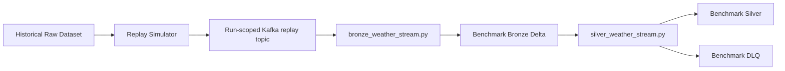
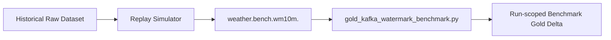
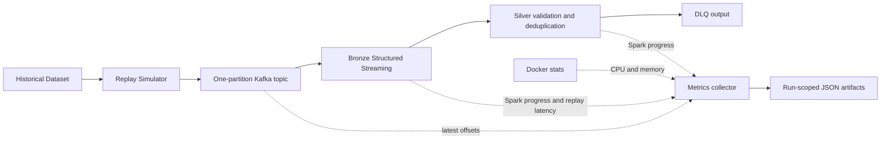

# Reproducible Correctness Benchmarks

This document covers the two correctness scenarios supported by
`benchmark/run_benchmark.py`. Historical runtime observations supplied during
development remain useful references; each new execution records its own
configuration and result.

## Status vocabulary

Keep these facts separate for every run:

- **Implementation:** the source code and intended behavior exist.
- **Runtime validation:** the component was executed and observed.
- **Reproducibility:** another developer can repeat the run from the repository
  and the documented commands.
- **Persisted result evidence:** the run's manifest, input summary, and checker
  result are stored under `results/benchmarks/`.

The prior B0 and Kafka watermark runs were runtime-verified. Before this
framework, their result artifacts were not persisted. The historical values
below are regression references, not universal pass thresholds.

## Existing benchmark and diagnostic code

| File | Classification | Use |
|---|---|---|
| `spark/jobs/bronze_weather_stream.py` | LIVE / reusable benchmark job | Production Bronze job; benchmark settings supply an isolated topic, path, checkpoint, and bounded `availableNow` trigger. |
| `spark/jobs/silver_weather_stream.py` | LIVE / reusable benchmark job | Production Silver and DLQ jobs; benchmark settings supply isolated inputs, outputs, checkpoints, and a bounded trigger. |
| `spark/jobs/check_benchmark_bronze.py` | CHECKER | Inspects Bronze records and simulator fault metadata. |
| `spark/jobs/check_benchmark_silver.py` | CHECKER | Runs the B0 count, DLQ, deduplication, and quality assertions and writes `result.json`. |
| `spark/jobs/check_watermark_benchmark.py` | DIAGNOSTIC CHECKER | Inspects the earlier Silver watermark experiment. |
| `spark/jobs/check_replay_event_lag.py` | DIAGNOSTIC | Estimates event-time lag from replay arrival ordering. |
| `spark/jobs/gold_watermark_benchmark.py` | DEPRECATED EXPERIMENT | Reads physical Silver Delta file order. It is invalidated as a Kafka arrival-order watermark benchmark. |
| `spark/jobs/gold_kafka_watermark_benchmark.py` | REUSABLE BENCHMARK | Current Kafka-direct Gold watermark implementation. |
| `spark/jobs/check_gold_watermark_benchmark.py` | CHECKER | Requires the Kafka watermark scenario and run identity, reads that run's Kafka input and derived Gold path, and writes `result.json`. |
| `spark/jobs/init_benchmark_bronze.py` | ONE-OFF INITIALIZER | Legacy helper; the run-scoped B0 runner does not use it. |

## B0 correctness

B0 validates that the production Bronze and Silver jobs preserve and classify
the simulator's messages correctly.



The Kafka topic is unique to the run. Bronze and Silver reuse the production
jobs with run-scoped paths and checkpoints. The live `weather.raw` topic,
live Delta paths, and live checkpoints are not used.

The B0 checker records and asserts:

- source records, Kafka messages, and Bronze records;
- Silver and DLQ records;
- injected and removed duplicates;
- generated and DLQ-routed invalid events;
- NORMAL, LATE, and OUT_OF_ORDER counts;
- duplicate `event_id` groups and Silver quality violations;
- Bronze/Silver/DLQ/duplicate conservation.

The historical B0 reference produced 10,195 Bronze records, 9,903 Silver
records, 97 DLQ records, and 195 removed duplicates. It observed 8,892 NORMAL,
490 LATE, and 521 OUT_OF_ORDER Silver records, zero duplicate groups, and zero
quality violations. A changed result is measured and reported; these counts
are not hard-coded as pass criteria.

## Silver watermark diagnostic

The Silver watermark experiment observed 953 late events generated, 953
accepted, and none dropped. It remains a verified diagnostic and a useful
negative finding. Silver's `dropDuplicatesWithinWatermark` is not the final
general late-event rejection benchmark.

## Delta-order Gold experiment

`gold_watermark_benchmark.py` consumed Silver Delta files using
`maxFilesPerTrigger`. Physical file order does not preserve original Kafka
arrival order. Its result (97 accepted observations; 9,903 dropped, including
940 late and 8,962 normal) is therefore methodologically invalidated and
superseded. Keep it for historical context; do not use it to assess the final
Kafka watermark behavior.

## Kafka-direct Gold watermark

The current watermark scenario sends the replay directly to Kafka and lets
`gold_kafka_watermark_benchmark.py` consume that topic:



This path measures event-time window watermark handling, normal-event
preservation, late-event acceptance/rejection, and duplicate Gold keys. It
does not include the B0 Bronze → Silver → DLQ stages.

The established configuration is 10,000 source records, a requested replay
rate of 1,000 messages/second, zero duplicate/invalid/out-of-order rates, a
10% late rate, 4,000-event late delay, seed 42, a 10-minute watermark,
one-hour windows, and 500 Kafka offsets per trigger. A historical run accepted
9,103 of 10,000 observations, preserved all 9,047 NORMAL observations, dropped
897 of 953 LATE observations (94.12%), and produced zero duplicate Gold keys.
The measured late-drop rate is recorded, never required to equal 94.12%.

## Isolation and topic strategy

`spark/jobs/benchmark_config.py` owns scenario names, defaults, topic names,
and run-scoped resource paths. A run ID is used in its topic, Delta paths, and
checkpoints.

Topics use the pattern `weather.bench.<scenario>.<run_id>` and one partition.
Run-scoped topics prevent old messages from contaminating a new run. One
partition also preserves the simulator's overall arrival order for the
watermark scenario. This is a correctness setup; it does not represent a
multi-partition throughput or scalability test. Topics are retained and never
deleted by the runner.

Delta outputs are isolated under:

```text
/opt/project/data/benchmark/runs/{b0|wm10m}/{run_id}/
```

Checkpoints are isolated under:

```text
/opt/project/data/checkpoints/benchmark/runs/{b0|wm10m}/{run_id}/
```

The final watermark checker requires `BENCHMARK_SCENARIO` and `RUN_ID`.
Paths are derived from those values and any conflicting explicit path fails
fast. It cannot silently fall back to the old Delta-order Gold directory.

## Run a benchmark

From Windows PowerShell at the repository root:

```powershell
.\.venv\Scripts\Activate.ps1
docker compose up --build -d broker spark-master spark-worker
python -m pip install -r producer/requirements.txt
python benchmark/run_benchmark.py --scenario b0
python benchmark/run_benchmark.py --scenario wm10m
```

The runner generates a fresh timestamped run ID unless `--run-id` is supplied.
It creates a new one-partition topic and does not reuse or delete prior topics,
paths, or checkpoints. It refuses a dirty code tree so the manifest identifies
the tested commit; uncommitted result JSON from the immediately preceding run
is allowed so both scenarios can be executed before committing their evidence.

Use `--source`, `--max-source-events`, `--rate`, and `--seed` to select a
different bounded replay input. The simulator's actual generation rate is a
load-generation metric only.

The runner uses Spark's `availableNow` trigger for bounded Bronze/Silver
benchmark jobs. Live jobs keep their existing continuous-trigger behavior.
Delta Spark 4.0.0 is pinned for the Spark 4.x image; the same version is used
for its Python package and the Maven artifact resolved by `spark-submit`. Spark
resolves the Delta and Kafka connector packages into `/tmp/spark-ivy`, which is
writable by the container user.

## Run artifacts

Each run writes:

```text
results/benchmarks/{b0|wm10m}/{run_id}/
  manifest.json
  simulator.json
  result.json
```

- `manifest.json` records scenario, run ID, creation/completion times, Git
  commit, input source and limit, topic and partition count, fault settings,
  watermark/window/offset settings, all output/checkpoint paths, software
  versions, artifact paths, status, and result metrics.
- `simulator.json` records actual source/Kafka counts, injected fault counts,
  requested rate, observed generation rate, and producer flush status. The
  checkers use it as the run's input reference.
- `result.json` records checker metrics, named PASS/FAIL assertions, paths,
  scenario, run ID, and Git commit.

Only these small JSON artifacts are stored in the repository. Delta data and
checkpoints remain in the Docker named volume and are not committed.

Inspect recent runs with:

```powershell
Get-ChildItem .\results\benchmarks\b0 -Directory |
  Sort-Object LastWriteTime -Descending |
  Select-Object -First 1
Get-ChildItem .\results\benchmarks\wm10m -Directory |
  Sort-Object LastWriteTime -Descending |
  Select-Object -First 1
```

## Load generation versus throughput benchmarking

The replay simulator's earlier approximately 1,019 messages/second result was
only a load-generation measurement. It did not measure Spark/Kafka throughput.
The `throughput` scenario below measures the streaming pipeline separately.

## Performance Instrumentation

The fixed baseline runs the run-scoped Kafka topic through the production
Bronze, Silver, and DLQ streaming jobs. Gold is excluded so this first
measurement isolates Kafka ingress, Bronze writes, Silver validation, and
deduplication from aggregation state. Silver's 10-minute watermark and
`dropDuplicatesWithinWatermark` semantics remain unchanged. All simulator fault
rates are zero.



### Fixed configuration

Every run records observed Compose and Spark Master configuration in
`manifest.json`:

- Kafka 4.3.1, one partition, replication factor 1.
- One Spark 4.0.4 worker with 4 advertised cores and 4,096 MB worker memory.
- Bronze and Silver/DLQ run as two concurrent Spark applications. Each requests
  at most one executor core and 1,024 MB executor memory; each uses one SQL
  shuffle partition and a one-second processing-time trigger. The manifest
  captures the active applications reported by the Spark Master REST endpoint.
- Delta Spark 4.0.0. The benchmark uses client deploy mode and the existing
  writable `/tmp/spark-ivy` dependency cache.
- `docker inspect` reports no per-container CPU or memory hard limit for the
  worker or broker. Resource JSONL preserves Docker's reported memory
  denominator and separately records a configured container limit as `null`.

This is a single-worker capacity baseline. It does not compare partition counts,
Spark core allocations, or worker counts.

### Calibration and run sequence

Calibrate the simulator before applying rates to Spark:

```powershell
.\.venv\Scripts\python.exe benchmark\run_benchmark.py `
  --scenario throughput --calibrate-load-generator
```

Calibration runs 10,000 source records at 100, 500, 1,000, 2,000, and 5,000
requested messages/second, with no Spark queries running. A target passes when
`actual_generated_msgs_sec` is within ±10% of the requested rate. The tolerance
allows short-run rate-limiter and producer-flush jitter while rejecting a
materially different offered load. A pipeline run refuses a target without a
passing calibration for the same Git commit.

Run a supported rate with two independent repetitions and 50,000 source
records:

```powershell
.\.venv\Scripts\python.exe benchmark\run_benchmark.py `
  --scenario throughput --rate 100 --max-source-events 50000 --repetitions 2
.\.venv\Scripts\python.exe benchmark\run_benchmark.py `
  --scenario throughput --rate 500 --max-source-events 50000 --repetitions 2
.\.venv\Scripts\python.exe benchmark\run_benchmark.py `
  --scenario throughput --rate 1000 --max-source-events 50000 --repetitions 2
```

Proceed to 2,000 or 5,000 only when the prior rate is sustainably handled and
the generator calibration passes. Each run gets a new topic, Delta paths, and
checkpoints. Topics and run outputs are retained.

### Collected metrics and definitions

- The simulator records requested/actual messages per second, source and
  produced counts, generation start/end timestamps, generation duration,
  producer elapsed time, and remaining messages after `flush`.
- A shared PySpark `StreamingQueryListener` writes lifecycle events and each
  original `StreamingQueryProgress` object to `spark_progress.jsonl`. It keeps
  `batchId`, timestamp, `numInputRows`, both rows-per-second fields, the full
  `durationMs` map, source offsets, state operator details, and other Spark
  progress fields. The first two micro-batches of each query are marked
  `warmup_excluded: true` and retained in the raw file; summary averages omit
  them.
- Every second, the host samples Kafka's latest/high partition offsets using
  librdkafka and compares them with the Kafka source `endOffset` in Bronze
  progress. Lag is `sum(max(0, latest offset - Spark end offset))` over all
  topic partitions. This is a sampled offset backlog, not a Kafka consumer-group
  lag. `kafka_lag.jsonl` stores both offset sets and the computed lag; missing
  offsets remain `null`.
- Replay latency is measured for every Bronze message as
  `spark_processing_time - ingestion_time`. `ingestion_time` is assigned when
  the simulator sends the replay event; `spark_processing_time` is assigned by
  the Bronze micro-batch. Historical `event_time` is excluded. This measures
  replay-to-Bronze processing latency, not downstream Silver commit latency or
  historical event-time lateness. Percentiles use Spark `percentile_approx`
  with accuracy 10,000.
- Every second, `docker stats --no-stream` records CPU percent, memory usage,
  Docker-reported memory limit/denominator, and memory percent for
  `weather-spark-worker` and `weather-kafka`. `resource_metrics.jsonl` also
  records the configured hard memory limit when one exists.
- Duration averages and percentiles use Spark's `durationMs.triggerExecution`;
  the full per-component duration map remains available in raw progress.

### Sustainability and saturation classification

A run is sustainable only when all produced messages appear in both Bronze
and Silver source progress, the final sampled Kafka lag is zero, and both Spark
applications exit normally. The runner waits up to 300 seconds after replay
for this drain; `--drain-timeout` changes that bound.

- `UNDER_CAPACITY`: sustainable, with peak lag during replay no greater than
  two one-second trigger intervals of offered data (`2 × requested msg/s`).
- `NEAR_CAPACITY`: sustainable, but replay-time peak lag exceeds that allowance
  before draining.
- `SATURATED`: the drain bound expires or the final backlog remains nonzero,
  without a Spark/container failure.
- `FAILED`: a stream, metrics query, or required measurement fails.

This two-trigger allowance is tied to the configured trigger interval rather
than a guessed absolute row count. `result.json` also reports maximum and final
lag, replay-time peak lag, throughput, batch duration, latency, resource peaks,
and reasons for unavailable metrics.

### Run artifacts

Each run is stored under `results/benchmarks/throughput/{run_id}/`:

```text
manifest.json
simulator.json
spark_progress.jsonl
kafka_lag.jsonl
resource_metrics.jsonl
delta_metrics.json
result.json
```

Per-rate repetition summaries and simulator calibration summaries are written
to distinct timestamped directories under
`results/benchmarks/throughput/experiments/`. The run folders do not overwrite
earlier evidence. Delta data and checkpoints stay in the Docker volume and are
not committed.
