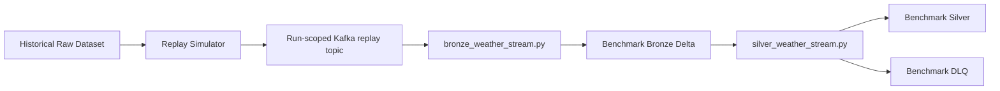
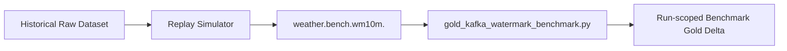
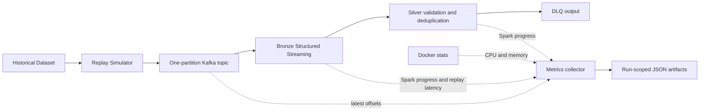
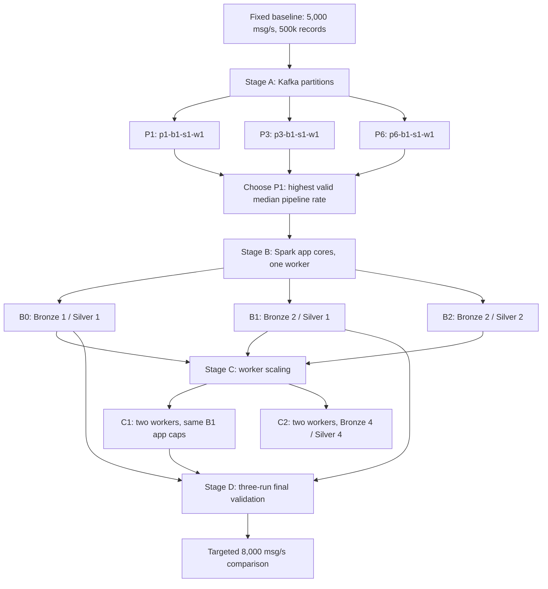

# Reproducible Correctness Benchmarks

This document covers the two correctness scenarios supported by
`benchmark/run_benchmark.py`. Historical runtime observations supplied during
development remain useful references; each new execution records its own
configuration and result.

## Status vocabulary

Keep these facts separate for every run:

- **Implementation:** the source code and intended behavior exist.
- **Runtime validation:** the component was executed and observed.
- **Reproducibility:** another developer can repeat the run from the repository
  and the documented commands.
- **Persisted result evidence:** the run's manifest, input summary, and checker
  result are stored under `results/benchmarks/`.

The prior B0 and Kafka watermark runs were runtime-verified. Before this
framework, their result artifacts were not persisted. The historical values
below are regression references, not universal pass thresholds.

## Existing benchmark and diagnostic code

| File | Classification | Use |
|---|---|---|
| `spark/jobs/bronze_weather_stream.py` | LIVE / reusable benchmark job | Production Bronze job; benchmark settings supply an isolated topic, path, checkpoint, and bounded `availableNow` trigger. |
| `spark/jobs/silver_weather_stream.py` | LIVE / reusable benchmark job | Production Silver and DLQ jobs; benchmark settings supply isolated inputs, outputs, checkpoints, and a bounded trigger. |
| `spark/jobs/check_benchmark_bronze.py` | CHECKER | Inspects Bronze records and simulator fault metadata. |
| `spark/jobs/check_benchmark_silver.py` | CHECKER | Runs the B0 count, DLQ, deduplication, and quality assertions and writes `result.json`. |
| `spark/jobs/check_watermark_benchmark.py` | DIAGNOSTIC CHECKER | Inspects the earlier Silver watermark experiment. |
| `spark/jobs/check_replay_event_lag.py` | DIAGNOSTIC | Estimates event-time lag from replay arrival ordering. |
| `spark/jobs/gold_watermark_benchmark.py` | DEPRECATED EXPERIMENT | Reads physical Silver Delta file order. It is invalidated as a Kafka arrival-order watermark benchmark. |
| `spark/jobs/gold_kafka_watermark_benchmark.py` | REUSABLE BENCHMARK | Current Kafka-direct Gold watermark implementation. |
| `spark/jobs/check_gold_watermark_benchmark.py` | CHECKER | Requires the Kafka watermark scenario and run identity, reads that run's Kafka input and derived Gold path, and writes `result.json`. |
| `spark/jobs/init_benchmark_bronze.py` | ONE-OFF INITIALIZER | Legacy helper; the run-scoped B0 runner does not use it. |

## B0 correctness

B0 validates that the production Bronze and Silver jobs preserve and classify
the simulator's messages correctly.



The Kafka topic is unique to the run. Bronze and Silver reuse the production
jobs with run-scoped paths and checkpoints. The live `weather.raw` topic,
live Delta paths, and live checkpoints are not used.

The B0 checker records and asserts:

- source records, Kafka messages, and Bronze records;
- Silver and DLQ records;
- injected and removed duplicates;
- generated and DLQ-routed invalid events;
- NORMAL, LATE, and OUT_OF_ORDER counts;
- duplicate `event_id` groups and Silver quality violations;
- Bronze/Silver/DLQ/duplicate conservation.

The historical B0 reference produced 10,195 Bronze records, 9,903 Silver
records, 97 DLQ records, and 195 removed duplicates. It observed 8,892 NORMAL,
490 LATE, and 521 OUT_OF_ORDER Silver records, zero duplicate groups, and zero
quality violations. A changed result is measured and reported; these counts
are not hard-coded as pass criteria.

## Silver watermark diagnostic

The Silver watermark experiment observed 953 late events generated, 953
accepted, and none dropped. It remains a verified diagnostic and a useful
negative finding. Silver's `dropDuplicatesWithinWatermark` is not the final
general late-event rejection benchmark.

## Delta-order Gold experiment

`gold_watermark_benchmark.py` consumed Silver Delta files using
`maxFilesPerTrigger`. Physical file order does not preserve original Kafka
arrival order. Its result (97 accepted observations; 9,903 dropped, including
940 late and 8,962 normal) is therefore methodologically invalidated and
superseded. Keep it for historical context; do not use it to assess the final
Kafka watermark behavior.

## Kafka-direct Gold watermark

The current watermark scenario sends the replay directly to Kafka and lets
`gold_kafka_watermark_benchmark.py` consume that topic:



This path measures event-time window watermark handling, normal-event
preservation, late-event acceptance/rejection, and duplicate Gold keys. It
does not include the B0 Bronze → Silver → DLQ stages.

The established configuration is 10,000 source records, a requested replay
rate of 1,000 messages/second, zero duplicate/invalid/out-of-order rates, a
10% late rate, 4,000-event late delay, seed 42, a 10-minute watermark,
one-hour windows, and 500 Kafka offsets per trigger. A historical run accepted
9,103 of 10,000 observations, preserved all 9,047 NORMAL observations, dropped
897 of 953 LATE observations (94.12%), and produced zero duplicate Gold keys.
The measured late-drop rate is recorded, never required to equal 94.12%.

## Isolation and topic strategy

`spark/jobs/benchmark_config.py` owns scenario names, defaults, topic names,
and run-scoped resource paths. A run ID is used in its topic, Delta paths, and
checkpoints.

Topics use the pattern `weather.bench.<scenario>.<run_id>` and one partition.
Run-scoped topics prevent old messages from contaminating a new run. One
partition also preserves the simulator's overall arrival order for the
watermark scenario. This is a correctness setup; it does not represent a
multi-partition throughput or scalability test. Topics are retained and never
deleted by the runner.

Delta outputs are isolated under:

```text
/opt/project/data/benchmark/runs/{b0|wm10m}/{run_id}/
```

Checkpoints are isolated under:

```text
/opt/project/data/checkpoints/benchmark/runs/{b0|wm10m}/{run_id}/
```

The final watermark checker requires `BENCHMARK_SCENARIO` and `RUN_ID`.
Paths are derived from those values and any conflicting explicit path fails
fast. It cannot silently fall back to the old Delta-order Gold directory.

## Run a benchmark

From Windows PowerShell at the repository root:

```powershell
.\.venv\Scripts\Activate.ps1
docker compose up --build -d broker spark-master spark-worker
python -m pip install -r producer/requirements.txt
python benchmark/run_benchmark.py --scenario b0
python benchmark/run_benchmark.py --scenario wm10m
```

The runner generates a fresh timestamped run ID unless `--run-id` is supplied.
It creates a new one-partition topic and does not reuse or delete prior topics,
paths, or checkpoints. It refuses a dirty code tree so the manifest identifies
the tested commit; uncommitted result JSON from the immediately preceding run
is allowed so both scenarios can be executed before committing their evidence.

Use `--source`, `--max-source-events`, `--rate`, and `--seed` to select a
different bounded replay input. The simulator's actual generation rate is a
load-generation metric only.

The runner uses Spark's `availableNow` trigger for bounded Bronze/Silver
benchmark jobs. Live jobs keep their existing continuous-trigger behavior.
Delta Spark 4.0.0 is pinned for the Spark 4.x image; the same version is used
for its Python package and the Maven artifact resolved by `spark-submit`. Spark
resolves the Delta and Kafka connector packages into `/tmp/spark-ivy`, which is
writable by the container user.

## Run artifacts

Each run writes:

```text
results/benchmarks/{b0|wm10m}/{run_id}/
  manifest.json
  simulator.json
  result.json
```

- `manifest.json` records scenario, run ID, creation/completion times, Git
  commit, input source and limit, topic and partition count, fault settings,
  watermark/window/offset settings, all output/checkpoint paths, software
  versions, artifact paths, status, and result metrics.
- `simulator.json` records actual source/Kafka counts, injected fault counts,
  requested rate, observed generation rate, and producer flush status. The
  checkers use it as the run's input reference.
- `result.json` records checker metrics, named PASS/FAIL assertions, paths,
  scenario, run ID, and Git commit.

Only these small JSON artifacts are stored in the repository. Delta data and
checkpoints remain in the Docker named volume and are not committed.

Inspect recent runs with:

```powershell
Get-ChildItem .\results\benchmarks\b0 -Directory |
  Sort-Object LastWriteTime -Descending |
  Select-Object -First 1
Get-ChildItem .\results\benchmarks\wm10m -Directory |
  Sort-Object LastWriteTime -Descending |
  Select-Object -First 1
```

## Load generation versus throughput benchmarking

The replay simulator's earlier approximately 1,019 messages/second result was
only a load-generation measurement. It did not measure Spark/Kafka throughput.
The `throughput` scenario below measures the streaming pipeline separately.

## Performance Instrumentation

The fixed baseline runs the run-scoped Kafka topic through the production
Bronze, Silver, and DLQ streaming jobs. Gold is excluded so this first
measurement isolates Kafka ingress, Bronze writes, Silver validation, and
deduplication from aggregation state. Silver's 10-minute watermark and
`dropDuplicatesWithinWatermark` semantics remain unchanged. All simulator fault
rates are zero.



### Fixed configuration

Every run records observed Compose and Spark Master configuration in
`manifest.json`:

- Kafka 4.3.1, one partition, replication factor 1.
- One Spark 4.0.4 worker with 4 advertised cores and 4,096 MB worker memory.
- Bronze and Silver/DLQ run as two concurrent Spark applications. Each requests
  at most one executor core and 1,024 MB executor memory; each uses one SQL
  shuffle partition and a one-second processing-time trigger. The manifest
  captures the active applications reported by the Spark Master REST endpoint.
- Delta Spark 4.0.0. The benchmark uses client deploy mode and the existing
  writable `/tmp/spark-ivy` dependency cache.
- `docker inspect` reports no per-container CPU or memory hard limit for the
  worker or broker. Resource JSONL preserves Docker's reported memory
  denominator and separately records a configured container limit as `null`.

This is a single-worker capacity baseline. It does not compare partition counts,
Spark core allocations, or worker counts.

### Calibration and run sequence

Calibrate the simulator before applying rates to Spark:

```powershell
.\.venv\Scripts\python.exe benchmark\run_benchmark.py `
  --scenario throughput --calibrate-load-generator
```

Calibration runs 10,000 source records at 100, 500, 1,000, 2,000, and 5,000
requested messages/second, with no Spark queries running. A target passes when
`actual_generated_msgs_sec` is within ±10% of the requested rate. The tolerance
allows short-run rate-limiter and producer-flush jitter while rejecting a
materially different offered load. Calibration may be reused across commits
only when the simulator, workload configuration, and simulator command are
proven unchanged. The selected calibration commit and compatibility reason are
recorded with each run.

Run a supported rate with two independent repetitions and 50,000 source
records:

```powershell
.\.venv\Scripts\python.exe benchmark\run_benchmark.py `
  --scenario throughput --rate 100 --max-source-events 50000 --repetitions 2
.\.venv\Scripts\python.exe benchmark\run_benchmark.py `
  --scenario throughput --rate 500 --max-source-events 50000 --repetitions 2
.\.venv\Scripts\python.exe benchmark\run_benchmark.py `
  --scenario throughput --rate 1000 --max-source-events 50000 --repetitions 2
```

Proceed to 2,000 or 5,000 only when the prior rate is sustainably handled and
the generator calibration passes. Each run gets a new topic, Delta paths, and
checkpoints. Topics and run outputs are retained.

### Existing 100 / 500 / 1,000 msg/s reanalysis

The six valid 50,000-message runs were recomputed from their persisted raw
progress, source-lag, resource, simulator, Delta, result, and manifest files.
The original run folders were read-only inputs. Per-run derived results include
SHA-256 hashes of every input file. These replace the previous `NEAR_CAPACITY`
labels.

| Requested | Actual | Bronze rows/s | Silver rows/s | Startup lag peak | Steady lag avg / p95 / peak | Lag slope (records/s) | Drain (s) | Replay→Bronze p50 / p95 / p99 | Class |
| ---: | ---: | ---: | ---: | ---: | :--- | ---: | ---: | :--- | :--- |
| 100 | 100.00 | 107.14 | 108.94 | 2,299 | 323 / 600 / 900 | -0.43 | 7.24 | 355 ms / 3.603 s / 13.150 s | `UNDER_CAPACITY` |
| 500 | 500.00 | 532.99 | 625.89 | 11,299 | 2,149 / 3,700 / 4,600 | -7.72 | 12.60 | 1.651 s / 12.135 s / 16.136 s | `UNDER_CAPACITY` |
| 1,000 | 999.99 | 967.99 | 1,640.06 | 22,300 | 5,173 / 7,645 / 8,300 | 158.78 | 9.25 | 2.580 s / 15.095 s / 17.096 s | `NEAR_CAPACITY` |

These are means across two runs. `pipeline_sustainable_rate` is the lower of
Bronze and main Silver steady-state processed rates. All six runs produced
50,000 messages, wrote 50,000 Bronze and Silver records, had zero DLQ records,
and ended with zero Kafka-to-Bronze source lag. At 1,000 msg/s the sampled
backlog grew during replay and then drained. Those 50,000-message windows
contain only four or five steady-state Bronze progress samples, so a longer
1,000 msg/s run is needed before fixing the capacity boundary.

Resource values below are means of the two runs at each rate. Docker CPU is a
host usage percentage and can exceed 100% when a container uses multiple host
logical CPUs; it is not a percentage of one Spark executor core. Historical
Docker inspection found no hard CPU quota, cpuset, or memory limit for either
container.

| Requested | Worker CPU avg / p95 / peak (%) | Worker RAM avg / p95 / peak (MiB) | Broker CPU avg / p95 / peak (%) | Broker RAM avg / p95 / peak (MiB) |
| ---: | :--- | :--- | :--- | :--- |
| 100 | 196.46 / 339.37 / 671.50 | 2,332.05 / 2,678.55 / 2,722.30 | 2.30 / 3.72 / 27.19 | 853.07 / 986.68 / 990.80 |
| 500 | 249.54 / 497.03 / 723.55 | 1,714.87 / 2,297.73 / 2,307.58 | 3.24 / 6.47 / 31.69 | 637.83 / 641.11 / 641.60 |
| 1,000 | 292.98 / 555.40 / 732.84 | 1,384.60 / 1,887.36 / 1,896.45 | 3.19 / 5.82 / 16.01 | 650.36 / 652.19 / 652.75 |

Original calibration measured actual rates near 100, 499, 1,000, 1,982, and
4,996 msg/s for requested 100, 500, 1,000, 2,000, and 5,000. The 2,000 and
5,000 msg/s pipeline runs above confirm those higher offered rates under the
fixed infrastructure.

Detailed results and raw input hashes are in [`raw artifact reanalysis`](../results/benchmarks/throughput/experiments/20260927T105412Z-07c8d44e/summary.json) and its `runs/` folder. Previous per-rate summaries remain at [`100 msg/s`](../results/benchmarks/throughput/experiments/20260927T093618Z-f4e02041/summary.json), [`500 msg/s`](../results/benchmarks/throughput/experiments/20260927T095536Z-2b9a845e/summary.json), and [`1,000 msg/s`](../results/benchmarks/throughput/experiments/20260927T100158Z-6981caa6/summary.json). A fresh B0 regression after the runner refinement passed all 11 assertions in [`this result`](../results/benchmarks/b0/20260927T110549Z-43ffbfba/result.json).

### Extended fixed-configuration rates (1,000 / 2,000 / 5,000 msg/s)

The original 1,000 msg/s replay had only four or five steady-state Bronze
samples. Two longer 100,000-record repetitions provided 50 seconds of offered
load and were classified `UNDER_CAPACITY`. Since this rate remained
sustainable, two 100,000-record repetitions were measured at 2,000 msg/s.
Both completed and drained, so the conditional 5,000 msg/s step first used
250,000 records per repetition. Those runs retained 50 seconds of offered
load but only 8–9 seconds after the warm-up cutoff, leaving just 2 Bronze and
1 Silver steady-state progress samples. They were repeated at 500,000 records
per repetition; those 100-second replays provided 51.9 and 59.5 seconds of
steady-state data. All runs kept the fixed configuration above and used zero
fault injection.

| Requested (records × reps) | Actual (msg/s) | Bronze / Silver (rows/s) | Startup peak lag | Steady avg / p95 / peak lag | Lag slope (records/s) | Drain (s) | Replay→Bronze p50 / p95 / p99 | Per-run classes | Aggregate |
| ---: | ---: | ---: | ---: | ---: | ---: | ---: | :--- | :--- | :--- |
| 1,000 (100k × 2) | 999.995 | 1,121.32 / 1,254.46 | 24,800 | 4,553 / 8,500 / 10,000 | -28.23 | 9.36 | 1.779 s / 14.007 s / 18.009 s | UNDER / UNDER | `UNDER_CAPACITY` |
| 2,000 (100k × 2) | 1,999.969 | 2,060.00 / 3,623.53 | 48,800 | 9,421 / 12,490 / 13,200 | 44.69 | 11.10 | 2.804 s / 15.952 s / 17.952 s | NEAR / UNDER | `NEAR_CAPACITY` |
| 5,000 (500k × 2) | 4,999.959 | 5,378.08 / 6,289.22 | 138,899 | 31,684 / 52,480 / 59,600 | 91.45 | 17.00 | 2.371 s / 15.330 s / 19.366 s | UNDER / NEAR | `NEAR_CAPACITY` |

Both repetitions at each extended rate wrote all expected Bronze and Silver
records, ended with zero Kafka-to-Bronze source lag, and drained after replay.
The 2,000 msg/s runs differed: one was `NEAR_CAPACITY` and one
`UNDER_CAPACITY`, so their aggregate is reported as `NEAR_CAPACITY`. In the
longer 5,000 msg/s runs, the steady-state windows contained 14/6 and 14/7
Bronze/Silver progress samples plus 51 and 59 Kafka lag samples. One run was
`UNDER_CAPACITY` and one was `NEAR_CAPACITY`; their aggregate is therefore
`NEAR_CAPACITY`. The mean lag slope was 91 records/s, close to the 2% offered
rate threshold, and the mean pipeline throughput exceeded the actual offered
rate. Both runs drained in about 17 seconds. The earlier 250,000-record runs
showed roughly 1,000 records/s lag growth, but their short qualified window
made them unsuitable as the primary capacity estimate; their raw artifacts
remain available for comparison.

| Requested | Worker CPU avg / p95 / peak (%) | Worker RAM avg / p95 / peak (MiB) | Broker CPU avg / p95 / peak (%) | Broker RAM avg / p95 / peak (MiB) |
| ---: | :--- | :--- | :--- | :--- |
| 1,000 (100k × 2) | 255.63 / 505.20 / 697.75 | 1,725.13 / 2,284.75 / 2,297.86 | 4.05 / 6.09 / 40.03 | 804.00 / 807.16 / 807.50 |
| 2,000 (100k × 2) | 286.98 / 597.11 / 753.51 | 1,496.91 / 2,126.31 / 2,127.87 | 3.61 / 6.53 / 10.62 | 826.64 / 829.53 / 830.00 |
| 5,000 (500k × 2) | 261.72 / 502.19 / 758.28 | 1,884.72 / 2,473.65 / 2,493.44 | 8.10 / 17.05 / 46.19 | 850.65 / 856.60 / 860.05 |

The longer 1,000 msg/s evidence shows the earlier 50,000-record `NEAR_CAPACITY`
classification was inconclusive: the extended repetitions are
`UNDER_CAPACITY`. The measured fixed-configuration region is therefore
`UNDER_CAPACITY` through 1,000 msg/s, with `NEAR_CAPACITY` behavior appearing
by 2,000 msg/s. At 5,000 msg/s the longer repetitions are mixed between
`UNDER_CAPACITY` and `NEAR_CAPACITY`, with the aggregate remaining
`NEAR_CAPACITY`. No run met the strict `SATURATED` classification through
5,000 msg/s; this milestone stops here without extrapolating to a higher rate
or changing infrastructure.

Raw telemetry and per-run outputs are retained with the [`1,000 msg/s extended`](../results/benchmarks/throughput/experiments/20260927T110751Z-9942215f/summary.json), [`2,000 msg/s`](../results/benchmarks/throughput/experiments/20260927T111414Z-548a979e/summary.json), and [`5,000 msg/s extended`](../results/benchmarks/throughput/experiments/20260927T112854Z-96904d6c/summary.json) experiment summaries. The initial [`5,000 msg/s 250,000-record runs`](../results/benchmarks/throughput/experiments/20260927T111912Z-318a4d6e/summary.json) remain saved with their sample-count limitation.

### Metrics, steady-state selection, and completion

- The simulator records requested and actual producer rates, produced messages,
  replay start/end, generation duration, producer time, and remaining messages
  after `flush`.
- A shared Spark `StreamingQueryListener` retains query lifecycle events and
  original progress payloads in `spark_progress.jsonl`, including batch IDs,
  row rates, input counts, duration components, and source offsets. All startup
  samples stay in the raw file; new summaries do not discard a fixed number of
  batches.
- Steady-state starts at the latest of: first main query start plus 15 seconds,
  completion of the third progress batch for both Bronze and main Silver, and
  replay start. It ends at simulator replay end. Post-replay drain is excluded
  from throughput and lag-trend calculations. If either query does not complete
  three batches, steady-state measurement is incomplete. The warm-up policy,
  warm-up start, steady-state start/end, and per-query sample counts are saved in
  `manifest.json` and `result.json`.
- Bronze and main Silver throughput are summarized separately from
  `processedRowsPerSecond`. The pipeline rate is the lower observed stage rate;
  DLQ progress is excluded from main Silver throughput.
- The sampler compares Kafka high offsets with Bronze Kafka source `endOffset`,
  summing positive offset differences across topic partitions.
  `kafka_to_bronze_lag` is a sampled source backlog, not consumer-group lag or a
  whole-pipeline metric. Results include startup peak, steady-state
  average/p95/peak, linear lag slope, and final source lag. Negative or near-zero
  slope means stable/draining backlog; sustained positive slope means growth
  during replay.
- Pipeline completion requires final source lag zero, exact expected Bronze
  and Silver Delta counts, expected progress in both queries, and clean stream
  shutdown. `pipeline_drain_seconds` is the later Bronze/Silver completion time
  minus replay end. Kafka lag zero by itself does not prove Silver completion.
- `replay_to_bronze_latency_ms` is Bronze processing timestamp minus simulator
  replay ingestion timestamp. It excludes Silver commit time and historical
  event time, so it is not full pipeline end-to-end latency. Percentiles use
  Spark `percentile_approx` with accuracy 10,000.
- Each second, `docker stats --no-stream` records CPU and memory for the Spark
  worker and Kafka broker. Docker inspection records host logical CPU count,
  CPU quota and period, cpuset, and hard memory limit. Unset limits are `null`;
  Docker's reported memory denominator remains separate from a configured cap.
  Resource summaries include average, p50, p95, and peak. Batch duration uses
  `durationMs.triggerExecution`; raw component durations remain available.

### Capacity classification

Startup peak lag is reported but never used alone to classify capacity. Let
`R` be actual producer rate, `P` the lower Bronze/Silver steady-state rate, `S`
the steady-state lag slope, `D` replay duration, and `T` pipeline drain time:

- `FAILED`: a stream, checker, or required metric fails; a no-fault run injects
  unexpected faults; or source lag is zero while expected output/progress counts
  are incomplete.
- `SATURATED`: the pipeline cannot finish with zero source lag, or
  `S > max(20, 10% of R)` while `P < 90% of R`.
- `UNDER_CAPACITY`: the complete pipeline has `S <= max(10, 2% of R)`,
  `P >= 95% of R`, and `T <= max(15 seconds, 25% of D)`.
- `NEAR_CAPACITY`: a complete, drained run misses the `UNDER_CAPACITY`
  thresholds without meeting the sustained `SATURATED` rule.

These labels apply to the fixed configuration and finite replay workload. This
milestone does not change Kafka partitions, Spark workers/cores/memory, shuffle
partitions, trigger interval, or fault rates.

### Reanalysis and longer run commands

Recompute existing summaries from raw telemetry without changing the input
folders:

```powershell
python benchmark/reanalyze_throughput.py --rates 100,500,1000
```

For high rates, use enough records to provide at least 30–60 seconds of input.
Examples are 100,000 records at 1,000 or 2,000 msg/s and 500,000 records at
5,000 msg/s when a 250,000-record replay leaves too little qualified
steady-state time after warm-up. Keep all infrastructure and other workload
settings fixed. This milestone measured 2,000 and 5,000 only after the
preceding rate completed and drained; do not treat these examples as a reason
to test beyond 5,000.

### Run artifacts

Each run is stored under `results/benchmarks/throughput/{run_id}/`:

```text
manifest.json
simulator.json
spark_progress.jsonl
kafka_lag.jsonl
resource_metrics.jsonl
delta_metrics.json
result.json
```

Per-rate summaries, raw-artifact reanalyses, and simulator calibration summaries
are written to separate timestamped directories under
`results/benchmarks/throughput/experiments/`. Reanalysis never rewrites raw run
files. Delta data and checkpoints stay in the Docker volume and are not
committed.


## Scalability Benchmark

This milestone measures Kafka partition, Spark application core, and Spark
worker scaling through the existing run-scoped replay pipeline. It preserves
the 20-location historical dataset, validation/deduplication/watermark
semantics, zero fault injection, and leaves Gold aggregation outside the
primary path.

### Baseline and methodology

The fixed baseline uses one Kafka partition; one Spark worker with 4 cores and
4,096 MiB; Bronze and Silver caps of one core each; one executor core and
1,024 MiB per executor; one SQL shuffle partition; and a one-second trigger.
The primary workload is 5,000 msg/s with 500,000 source records, about 100
seconds of offered input. Duplicate, invalid, late, and out-of-order rates are
all zero.

The benchmark follows OFAT. Config IDs use
p<partitions>-b<bronze cores>-s<silver cores>-w<workers>; for example,
p1-b2-s1-w2 means one Kafka partition, two Bronze cores, one Silver core, and
two Spark workers.

Every report separates `bronze_processed_rate`, `silver_processed_rate`, and
`pipeline_sustainable_rate`. Reanalysis aggregates each stage over the valid
repetitions first, then defines the pipeline rate as the minimum of the
aggregated Bronze and Silver steady-state rates. The pipeline rate is null if
either stage is missing or invalid. Speedup and throughput gain use candidate
pipeline rate divided by baseline pipeline rate; compute efficiency uses
measured allocated cores. Stage-specific rates are never substituted for the
pipeline rate.



Gold is excluded to measure Kafka ingress, Bronze writes, Silver validation
and deduplication, and Delta writes without adding aggregation state as a
separate bottleneck.

### Commands and artifacts

Run a configuration with the existing benchmark runner:

    python benchmark/run_benchmark.py --scenario scalability --rate 5000 --max-source-events 500000 --partitions 3 --bronze-cores 1 --silver-cores 1 --workers 1 --config-id p3-b1-s1-w1 --repetitions 2

For a two-worker run, scale the Compose worker service, wait for two ALIVE
workers in Spark Master, run the configuration, then restore one worker:

    docker compose up -d --scale spark-worker=2 spark-worker
    python benchmark/run_benchmark.py --scenario scalability --rate 5000 --max-source-events 500000 --partitions 1 --bronze-cores 2 --silver-cores 1 --workers 2 --config-id p1-b2-s1-w2 --repetitions 2
    docker compose up -d --scale spark-worker=1 spark-worker

Each run stores manifest.json, simulator.json, result.json,
spark_cluster_snapshot.json, spark_progress.jsonl, kafka_lag.jsonl,
resource_metrics.jsonl, and Delta metrics under
results/benchmarks/scalability/{run_id}/. Experiment summaries and manifests
live under results/benchmarks/scalability/experiments/{experiment_id}/.
Raw telemetry remains with its run. These JSON artifacts are small enough to
persist with the source; Delta output and checkpoints remain in the Docker
volume. The three-repetition final aggregation is
[20260927T152924Z-988f7da5](../results/benchmarks/scalability/experiments/20260927T152924Z-988f7da5/summary.json).
The primary matrix and stress evidence are summarized in
[20260927T140207Z-101f56f0](../results/benchmarks/scalability/experiments/20260927T140207Z-101f56f0/summary.json).
The corrected stage aggregation and source checksums are in the
[scalability closure reanalysis](../results/benchmarks/scalability/experiments/20260927T162057Z-closure-reanalysis/summary.json).

### Stage A: Kafka partitions

P1 and P3 each had two valid repetitions. P6 finished replay and eventually
processed all records but had no eligible steady-state sample window, so it is
excluded from throughput selection.

| Config | Partitions | Actual producer (msg/s) | Bronze (rows/s) | Silver (rows/s) | Pipeline (rows/s) | Lag p95 | Replay-to-Bronze p95 | Drain (s) | Valid reps |
| :--- | ---: | ---: | ---: | ---: | ---: | ---: | ---: | ---: | ---: |
| p1-b1-s1-w1 | 1 | 4,999.97 | 5,591.41 | 6,902.50 | 5,591.41 | 45,685 | 25.246 s | 12.31 | 2/2 |
| p3-b1-s1-w1 | 3 | 4,999.98 | 5,472.94 | 6,058.99 | 5,472.94 | 44,370 | 15.772 s | 14.08 | 2/2 |
| p6-b1-s1-w1 | 6 | 4,999.96 | N/A | N/A | N/A | N/A | 88.355 s | 42.62 | 0/1 |

P3's median pipeline rate was 2.12% below P1. P3 reduced replay-to-Bronze
p95 latency but did not increase throughput. P6 has no valid steady-state
comparison, so the data cannot establish a throughput result above three
partitions. With each Spark application capped at one core and one SQL shuffle
partition, adding Kafka partitions alone did not add processing capacity.

The keyed simulator was not evenly distributed. Each P3 run recorded
{0: 125,000, 1: 275,000, 2: 100,000} records (minimum 100,000, maximum
275,000, mean 166,667, max/mean imbalance 1.65). P6 recorded
{0: 50,000, 1: 125,000, 2: 50,000, 3: 75,000, 4: 150,000, 5: 50,000}
(minimum 50,000, maximum 150,000, mean 83,333, imbalance 1.80). P1 placed
all 500,000 records on its single partition (imbalance 1.00). Each run retains
the actual Kafka offsets. With only 20 location keys, partition count is not
a proxy for balanced load.

P1 was selected for Stage B because it had the highest valid median pipeline
rate. P3's 2.12% lower rate was outside the 2% tie window; P6 was ineligible.

### Stages B and C: Spark cores and workers

The two-repetition primary matrix medians drove stage selection. The final
validation below adds one independent run for B0, B1, and C1.

| Config | Workers | Bronze / Silver cap | Actual cores | Bronze (rows/s) | Silver (rows/s) | Pipeline (rows/s) | Change vs B0 | Lag p95 | Latency p95 | Drain (s) | Class |
| :--- | ---: | :--- | ---: | ---: | ---: | ---: | ---: | ---: | ---: | ---: | :--- |
| B0 p1-b1-s1-w1 | 1 | 1 / 1 | 2 | 5,591.41 | 6,902.50 | 5,591.41 | 1.000x | 45,685 | 25.246 s | 12.31 | UNDER |
| B1 p1-b2-s1-w1 | 1 | 2 / 1 | 3 | 5,647.27 | 7,253.61 | 5,647.27 | 1.010x | 38,440 | 24.705 s | 13.33 | UNDER |
| B2 p1-b2-s2-w1 | 1 | 2 / 2 | 4 | 5,606.69 | 5,628.42 | 5,606.69 | 1.003x | 44,645 | 39.861 s | 15.08 | mixed |
| C1 p1-b2-s1-w2 | 2 | 2 / 1 | 3 | 5,564.61 | 6,128.60 | 5,564.61 | 0.995x | 46,515 | 23.754 s | 14.07 | UNDER |
| C2 p1-b4-s4-w2 | 2 | 4 / 4 | invalid | N/A | N/A | N/A | N/A | N/A | N/A | N/A | FAILED |

B1 was the highest measured single-worker median in Stage B, so it was
selected for Stage C. Its approximately 1% gain came with 50% more actual
application cores. Reanalysis changes B2's pipeline median from 5,017.55 to
5,606.69 rows/s: the old summary averaged per-run stage minima, while the
corrected summary first aggregates Bronze and Silver and then takes their
minimum. That is a 0.27% gain over the two-run B0 matrix reference, below the
5% material-improvement threshold; B2's p95 latency was 39.861 seconds.
One SQL shuffle partition and the single-host environment remain limitations
on interpreting extra Silver cores.

C1 preserves the B1 application caps while increasing worker count. It did not
add Spark application cores: B1 and C1 both allocated three cores total. At
5,000 msg/s, two workers did not improve throughput (5,564.61 vs 5,647.27
rows/s). C2's expanded-compute attempt was invalid: the broker stopped with
exit code 137 and only 214,799 records had reached Spark. The captured logs
showed broker unavailability, and Docker lag/stat sampling timed out. The
historical container state and relevant Docker events were unavailable, so
the exit cause, including whether it was OOM, is unconfirmed. See
[C2 Failure Diagnosis](#c2-failure-diagnosis).

### Three-run final comparison at 5,000 msg/s

Values below are medians across three valid independent runs per
configuration. All nine runs offered approximately 5,000 msg/s, wrote 500,000
Bronze and 500,000 Silver records, wrote zero DLQ rows, and ended with zero
Kafka-to-Bronze lag. All were classified UNDER_CAPACITY.

| Config | Actual rate | Bronze (rows/s) | Silver (rows/s) | Pipeline (rows/s) | Startup lag peak | Steady lag avg / p95 / peak | Lag slope (records/s) | Latency p50 / p95 / p99 | Drain (s) |
| :--- | ---: | ---: | ---: | ---: | ---: | :--- | ---: | :--- | ---: |
| B0 p1-b1-s1-w1 | 4,999.97 | 5,562.45 | 6,881.69 | 5,562.45 | 180,399 | 25,341 / 43,420 / 48,000 | -225.35 | 2.072 / 26.284 / 30.319 s | 12.56 |
| B1 p1-b2-s1-w1 | 4,999.97 | 5,565.14 | 6,402.56 | 5,565.14 | 127,599 | 19,874 / 36,800 / 43,600 | -228.41 | 1.527 / 13.607 / 17.641 s | 14.08 |
| C1 p1-b2-s1-w2 | 4,999.97 | 5,459.15 | 6,314.85 | 5,459.15 | 175,999 | 20,325 / 36,750 / 44,000 | -174.78 | 1.860 / 26.197 / 30.231 s | 12.06 |

B1 is only 0.05% above B0 by the three-run median. Treat that as effectively
tied, not as a material throughput improvement. B1's median p95 latency was
lower, but one repetition was noisier; three runs do not establish a general
tail-latency guarantee.

### Speedup and resource efficiency

Speedup is candidate median pipeline throughput divided by B0 median pipeline
throughput. The compute multiplier uses measured Spark Master total allocated
cores, not requested settings. Efficiency is speedup divided by compute
multiplier. Throughput/core is pipeline rows/s divided by actual cores. These
are descriptive for this single-host setup, not linear-scaling claims.

| Config | Pipeline (rows/s) | Actual cores | Speedup | Compute multiplier | Efficiency | Rows/s/core |
| :--- | ---: | ---: | ---: | ---: | ---: | ---: |
| B0 | 5,562.45 | 2 | 1.000x | 1.00x | 100.0% | 2,781.23 |
| B1 | 5,565.14 | 3 | 1.000x | 1.50x | 66.7% | 1,855.05 |
| C1 | 5,459.15 | 3 | 0.981x | 1.50x | 65.4% | 1,819.72 |
| B2, matrix only | 5,606.69 | 4 | 1.008x | 2.00x | 50.4% | 1,401.67 |

B1 is the numeric 5,000 msg/s median leader, but its gain over B0 is only
0.05% for 50% more cores. B0 is the more resource-efficient choice. At this
offered rate the final configurations were input-limited.

### Targeted higher stress at 8,000 msg/s

Since all 5,000 msg/s finalists were UNDER_CAPACITY, the benchmark calibrated
8,000 msg/s on the current code and ran only B0, B1, and C1. The calibrated
producer rate was 7,996.70 msg/s (0.04% deviation, within the 10% band).
Each configuration used 800,000 records and had two valid repetitions,
providing about 100 seconds of offered input. An earlier 500,000-record
attempt did not qualify for the minimum warm-up and three-batch steady-state
window, so it is excluded.

| Config | Partitions | Workers | B/S core caps | Actual cores | Bronze (rows/s) | Silver (rows/s) | Pipeline (rows/s) | Speedup vs B0 | Lag p95 | Latency p95 | Drain (s) | Class |
| :--- | ---: | ---: | :--- | ---: | ---: | ---: | ---: | ---: | ---: | ---: | ---: | :--- |
| B0 p1-b1-s1-w1 | 1 | 1 | 1 / 1 | 2 | 8,855.04 | 9,042.53 | 8,855.04 | 1.000x | 71,470 | 11.239 s | 14.58 | UNDER / UNDER |
| B1 p1-b2-s1-w1 | 1 | 1 | 2 / 1 | 3 | 8,648.34 | 8,154.95 | 8,154.95 | 0.921x | 64,460 | 22.657 s | 19.10 | UNDER / NEAR |
| C1 p1-b2-s1-w2 | 1 | 2 | 2 / 1 | 3 | 8,966.95 | 6,129.94 | 6,129.94 | 0.692x | 80,100 | 17.512 s | 26.12 | NEAR / UNDER |
| P3-B2-S2 p3-b2-s2-w1 | 3 | 1 | 2 / 2 | 4 allocated | N/A* | N/A* | N/A* | N/A | N/A | N/A | N/A | FAILED_RESOURCE_LIMIT |

The old 8,000 msg/s summary used the mean of each run's per-run minimum for
some pipeline values. The corrected rule first aggregates each stage and then
takes the minimum. The corrected pipeline rates are 8,855.04 for B0,
8,154.95 for B1, and 6,129.94 rows/s for C1. Relative to B0, B1 is 0.921x
(-7.91%) and C1 is 0.692x (-30.77%). Equivalently, B0 is 1.086x B1 and
1.445x C1. B1 is Silver-limited (8,154.95 vs 8,648.34 Bronze), and C1 is
more strongly Silver-limited (6,129.94 vs 8,966.95 Bronze). For B0, Bronze is
the slower measured stage. C1's pipeline was 24.83% below B1 even though
both allocated three application cores; the two-worker placement did not
improve this workload. These two-run comparisons are descriptive, not
statistical significance tests.

The P3-B2-S2 row is an attempted configuration but has no valid comparison
rate. One run generated all 800,000 inputs at 7,999.91 msg/s and the observed
partition offsets covered all messages. The host was interrupted for memory
safety before correctness checks completed. Its partial Bronze/Silver rates
(9,078.82 / 9,111.39 rows/s) are diagnostic only and are excluded from the
table, speedups, capacity assessment, and conclusions.

| Config | Worker CPU avg / p95 / peak (%) | Worker RAM avg / p95 / peak (MiB) | Kafka CPU avg / p95 / peak (%) | Kafka RAM avg / p95 / peak (MiB) |
| :--- | :--- | :--- | :--- | :--- |
| B0, 8k | 255.58 / 488.37 / 702.55 | 1,710.53 / 2,231.40 / 2,269.18 | 14.31 / 45.25 / 96.24 | 1,057.60 / 1,072.54 / 1,075.20 |
| B1, 8k | 303.62 / 647.46 / 841.43 | 2,134.46 / 2,754.43 / 2,809.86 | 7.42 / 19.30 / 39.04 | 888.87 / 977.51 / 982.77 |
| C1, 8k | 329.38 / 677.71 / 932.98 | 2,236.34 / 2,953.84 / 2,963.89 | 12.61 / 30.18 / 75.20 | 797.08 / 828.76 / 837.50 |

A 10,000 msg/s test was unnecessary: the valid 8,000 msg/s comparison already
separated the three valid finalists. No valid run was classified SATURATED;
the benchmark found relative performance limits without observing hard
saturation.

### Partition × Core Interaction Validation

The targeted p3-b2-s2-w1 attempt used the requested three Kafka partitions,
one Spark worker, two Bronze cores, two Silver cores, one core per executor,
1,024 MiB per executor, and one shuffle partition. The Spark Master snapshot
confirmed two one-core executors per stage on the one live worker. Thus the
requested allocation was observed, but the run is not valid for performance
comparison because the host memory safety stop occurred before the correctness
suite completed.

| Config | Workload | P | B/S cores | Pipeline (rows/s) | Gain vs P1-B1-S1 | Partition imbalance | Interpretation |
| :--- | ---: | ---: | :--- | ---: | ---: | ---: | :--- |
| P1-B1-S1 | 5,000 msg/s | 1 | 1 / 1 | 5,591.41 | baseline | 1.00 | Valid primary-matrix baseline |
| P3-B1-S1 | 5,000 msg/s | 3 | 1 / 1 | 5,472.94 | -2.12% | 1.65 | Partition parallelism alone did not improve throughput |
| P1-B2-S2 | 5,000 msg/s | 1 | 2 / 2 | 5,606.69 | +0.27% | 1.00 | Two valid reps; below the material-improvement threshold |
| P3-B2-S2 | 8,000 msg/s | 3 | 2 / 2 | N/A | N/A | 1.65 | Attempted once; invalid for comparison after memory safety interruption |

The 800,000-event P3 attempt was distributed as P0=200,000, P1=440,000, and
P2=160,000 (minimum 160,000, maximum 440,000, mean 266,666.67, max/mean
imbalance 1.65). This matches the earlier P3 imbalance ratio from the
20-location workload. The source and offsets completed, final Kafka-to-Bronze
lag was zero, and the run-scoped Spark apps were stopped cleanly after the
interrupt. However, expected Bronze/Silver counts and the remaining
correctness assertions were not recorded as passing. The run is therefore
invalid for throughput comparison despite its verified allocation.

At 5,000 msg/s, the P1-to-P3 one-core comparison did not improve pipeline
throughput. The P1-B2-S2 two-core-stage configuration was only 0.27% above its
P1 baseline, below the 5% material-improvement threshold. Since P3-B2-S2 has
no valid 8,000 msg/s result and no comparable P3-B2-S2 result at 5,000 msg/s,
the experiment cannot determine whether partition and compute parallelism
interact beneficially. It also cannot establish that P1 limited core scaling.
With n=2 for the valid primary configurations, no statistical-significance
claim is made. Treat <5% as no material improvement, 5–10% as small, and >10%
as material for descriptive interpretation only.

### C2 Failure Diagnosis

C2 (p1-b4-s4-w2) stopped after processing 214,799 records, with broker exit
code 137. The run result records Kafka lag-sampler timeouts and an 8-second
Docker stats timeout. Spark logs reported that the broker was unavailable.
After the broker restart, its log said it was recovering 159 logs because no
clean-shutdown file was present. Docker events queried for the relevant time
returned no retained event. The failed container's historical inspect state
was unavailable. The later restarted container showed OOMKilled=false,
ExitCode=0, and RestartCount=0; those later values do not prove how the prior
process ended.

Therefore the actual cause of exit 137 is **unconfirmed**. Exit 137 is
consistent with SIGKILL, but the available evidence does not establish an
OOM kill. Resource pressure is plausible: this single-host Docker environment
exposed a 6.698 GiB Docker memory limit while C2 requested eight one-core,
1,024 MiB executors, in addition to the broker, workers, and Spark master.
This mismatch is a risk indicator, not proof of the cause. No Docker memory
allocation, executor memory, core cap, or benchmark semantics were changed.
The C2 retry was skipped because a safe corrective change could not be
identified without changing the experimental environment. C2 remains
NOT_VALIDATED_ON_CURRENT_HOST; its partial output is excluded from all
throughput comparisons.

### Executor allocation and correctness

Spark Master snapshots were taken before and during replay:

- B0 allocated one one-core executor each to Bronze and Silver on its only
  worker (two cores total).
- B1 allocated two one-core Bronze executors and one one-core Silver executor
  on its only worker (three cores total).
- C1 placed its two Bronze executors across both workers and the single Silver
  executor on worker two. It still used three cores total. Each worker
  advertised 4 cores and 4,096 MiB. The Spark Master response reports total
  application cores and executor worker IDs; Spark submit logs report one core
  per executor.
- Docker CPU usage can exceed 100% because it aggregates host logical CPUs; it
  is not a per-executor utilization percentage.

Every valid no-fault run passed correctness: exact expected Bronze/Silver
counts, empty DLQ, no duplicate groups, no quality violations, zero final
Kafka-to-Bronze lag, and confirmed stream shutdown. A fresh B0 regression run
after the runner change is stored in
[20260927T153242Z-3cae6ccf](../results/benchmarks/b0/20260927T153242Z-3cae6ccf/result.json).
The P3-B2-S2 attempt is excluded from that statement because the run was
interrupted before its correctness assertions completed. The data source and
location catalog were not changed.

### Conclusions and limitations

- The valid 5,000 msg/s P3 one-core result was 2.12% below P1. P6 has no valid
  steady-state rate, so no throughput claim is made above P3.
- At 5,000 msg/s the three-run B1 median was 0.05% above B0. The corrected
  two-run B2 matrix pipeline was 0.27% above its B0 reference, below the
  material-improvement threshold; its p95 latency was 39.861 seconds.
- Adding a worker with unchanged application caps did not improve throughput.
  The valid C1 run had three actual application cores, the same as B1. The
  expanded B4/S4 two-worker C2 attempt remains unvalidated on this host.
- At 8,000 msg/s, B0 pipeline was 1.086x B1 and 1.445x C1. The candidate
  speedups vs B0 were 0.921x for B1 and 0.692x for C1. B0's measured slower
  stage was Bronze; B1 and C1 were Silver-limited. The P3-B2-S2 attempt has no
  valid rate, so these data do not decide whether combined source and compute
  parallelism would improve throughput.
- The measurements point to Silver/Delta processing as the constraint for
  B1 and especially C1 at 8,000 msg/s. One shuffle partition and single-host
  resource contention remain plausible contributors, but were not changed or
  isolated by this closure work.
- The 5,000 msg/s results were input-limited, so targeted calibrated 8,000
  msg/s validation was needed. Hard SATURATED behavior was not observed
  through 8,000 msg/s.
- All workers ran on one Windows host. Two Docker workers do not represent two
  physical machines; these results do not establish multi-node hardware
  scalability.

### Scalability Closure Status

Pipeline aggregation, speedup definitions, regression tests, corrected
historical summaries, and the C2 evidence review are complete. The required
P3-B2-S2 interaction is not complete: its first attempt was stopped when host
free memory reached 331 MiB, and no second run was started because the
observed peak allocation would leave insufficient headroom on the current
host. There are zero valid P3-B2-S2 repetitions. Therefore the interaction
question remains unanswered and this scalability closure is **not ready to
merge or tag**. Revisit the exact configuration when the same experimental
environment has enough safe memory headroom to complete two correctness-valid
runs. After closure and human review, the next milestone remains expanding
the historical dataset from 20 locations to the 63 old provinces/cities,
before feature engineering and model training.
