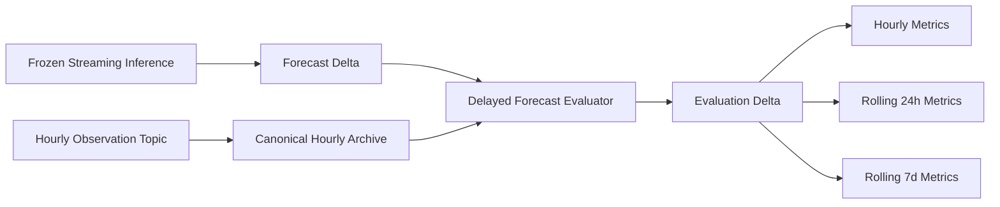
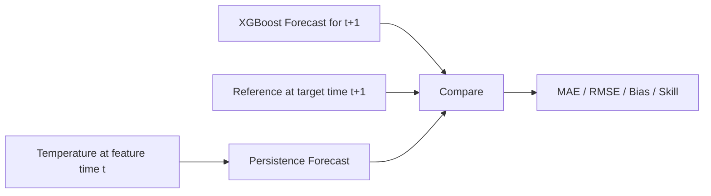
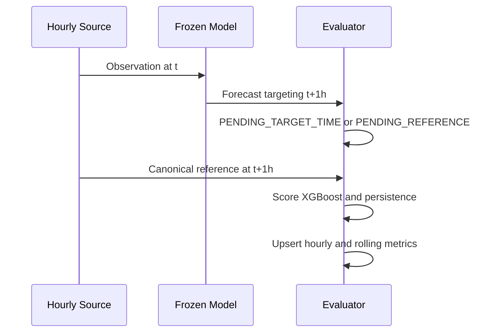

# Forecast Monitoring & Evaluation V1

## Purpose and frozen provenance

This phase closes the delayed evaluation loop for the already-frozen one-hour XGBoost system. It does not retrain, tune, or change inference behavior. The accepted forecast provenance is `WEATHER_XGBOOST_GLOBAL_T1H_V1` (model SHA-256 `07fffbaed3e4934017a03135eddba8fc200fbcd22b799d246ea816695f98704a`) with `WEATHER_FORECAST_FE_V1`, 73 ordered features, and feature-list SHA-256 `ec716f47ac4eca99a945a2ba1c50ba1297c1509a2aa5f80cff063042e40295bf`.

The evaluator reads the existing forecast Delta and the hourly observation topic. It writes a durable canonical reference archive before computing metrics. The inference job, its state contract, and its checkpoint remain independent.



## Evaluation reference and terminology

The reference is the canonical hourly record for the same `location_id`, source, and UTC `event_time == target_time`. The live source `OPEN_METEO_LIVE_HOURLY` comes from Open-Meteo Forecast API. It is a numerical weather-model product, not a station measurement; metrics therefore describe agreement with a model-derived reference, not station ground-truth accuracy.

The forecast feature observation is resolved by exact `(location_id, feature_time, source_event_id)`. The evaluator requires one matching source event and then uses that same source for the target-hour lookup. It does not fall back to a timestamp-only or location-only join. Replay and live references remain separate metric scopes.





## Persistence baseline, gate, and errors

For the same forecast, persistence is exactly `temperature_c` from the feature-time source event. It never reads target-time temperature. The target reference is the canonical `temperature_c` at the forecast target hour. Errors are consistently `prediction - reference`; absolute and squared errors are stored for both methods.

The evaluator will not score before `evaluation_time >= target_time`, even if a later row is present in its inputs. Scoring also requires an accepted target reference. The live-source backfill client applies the producer's safe cutoff (`floor(current UTC hour) - 1 hour`) and labels fetched historical values `LIVE_SOURCE_BACKFILL`; no future provider value is used as a realized reference.

## Durable archive and revision policy

| Dataset | Canonical path inside Spark | Key |
| --- | --- | --- |
| Hourly reference archive | `/opt/project/data/streaming/weather_hourly_observations_v1/observations` | `(source, location_id, event_time)` |
| Reference revisions | `/opt/project/data/streaming/weather_forecast_evaluation_v1/reference_revisions` | deterministic revision ID |
| Rejected observations | `/opt/project/data/streaming/weather_forecast_evaluation_v1/rejected_observations` | deterministic rejection ID |
| Forecast evaluations | `/opt/project/data/streaming/weather_forecast_evaluation_v1/evaluations` | `(forecast_id, evaluation_version)` |
| Hourly metrics | `/opt/project/data/streaming/weather_forecast_evaluation_v1/hourly_metrics` | source, mode, scope, target hour |
| Rolling global metrics | `/opt/project/data/streaming/weather_forecast_evaluation_v1/rolling_global_metrics` | source, mode, window, target hour |
| Rolling location metrics | `/opt/project/data/streaming/weather_forecast_evaluation_v1/rolling_location_metrics` | source, mode, window, target hour, location |
| Monitoring checkpoint | `/opt/project/data/checkpoints/weather_forecast_monitoring_v1` | separate from inference and Bronze/Silver/Gold |

The first accepted canonical payload wins. Identical physical duplicates are counted and ignored. A changed payload for the same source/location/hour writes `REFERENCE_REVISION_DETECTED` with old/new SHA-256, first/later event IDs and ingestion times, and detection time. It does not overwrite the archive row. A key with a detected revision cannot score new evaluations. Already `EVALUATED` rows remain frozen; revisions are retained as separate evidence.

Evaluation identity is `SHA256(evaluation_version + forecast_id + reference_source)`, with version `FORECAST_EVALUATION_V1`. Delta merges on `(forecast_id, evaluation_version)` ensure a late reference advances one pending row, while repeated runs do not add another row. Completed evaluations are immutable. Metric rows merge by deterministic `metric_id`, so pending hourly snapshots update when a reference arrives.

The lifecycle is:

| State | Meaning |
| --- | --- |
| `PENDING_TARGET_TIME` | The target hour has not passed the evaluator clock. |
| `PENDING_REFERENCE` | Target time passed, but the same-source target reference has not arrived. |
| `PENDING_BASELINE` | Exact feature-time source event is not available or is ambiguous. |
| `READY` | Reserved for a validated row ready to score; V1 scores immediately. |
| `EVALUATED` | Both model and persistence were scored against the same target reference. |
| `REFERENCE_CONFLICT` | A feature or target reference key has revision evidence. |
| `INVALID_PROVENANCE` | Forecast model, feature contract, ID, location, time, or prediction is invalid. |

## Metrics and completeness

Every completed row stores forecast provenance; feature and target event IDs; reference source, mode, and payload hash; both predictions; reference temperature; signed, absolute, and squared errors; inference, reference-ingestion, and evaluation timestamps; and reference-arrival/evaluation lags.

Aggregate metrics include MAE, RMSE (`sqrt(mean(squared_error))`), bias, and R² when defined. Bias is `mean(prediction - reference)`. Undefined R² and zero-persistence-denominator skill return `null`, never NaN or infinity. XGBoost skill is `1 - model_mae / persistence_mae`; positive means XGBoost has lower MAE. MAE/RMSE absolute and percentage improvements use persistence minus model. Global row-weighted metrics are `micro`; the arithmetic mean of location MAEs is explicitly `macro_location_mae`.

Hourly snapshots report expected/received/missing references, reference coverage, evaluation coverage, evaluated location count, descriptive quality status, both models' metrics, and distributions. Distribution diagnostics include temperature, humidity, pressure, precipitation, wind speed/gust, weather code, predictions, and errors with count, mean, population standard deviation, min, p05, p50, p95, and max. They are monitoring diagnostics, not a formal drift detector.

Rolling windows follow UTC target-time chronology. Global expected counts are 1,512 for 24h and 10,584 for 168h; per-location expected counts are 24 and 168. Metrics are still calculated from available evaluations, but `window_complete` remains false until the exact expected sample and location counts are present. Configured minimums default to 24 samples/location for the 24h window and 168/location for the 7d window; global quality status uses those thresholds multiplied by the 63 expected locations.

## Modes and configuration

The job is `spark/jobs/weather_forecast_monitoring.py`:

- `once`: consume currently available Kafka offsets with an `availableNow` trigger, archive, then evaluate.
- `daemon`: run the same cycle repeatedly; default polling interval is five minutes.
- `backfill`: reevaluate archived forecasts and references without consuming Kafka. An optional `--reference-backfill-target-time` fetches one already-safe live-source hour and tags it `LIVE_SOURCE_BACKFILL`.

Every run appends one JSON line per cycle to `results/forecast-monitoring/<RUN_ID>/monitoring_cycles.jsonl`. Cycle data includes counts, archive/read/join/evaluation/aggregation/total durations, rows per second, CPU time and peak RSS where available.

Paths and controls have CLI options and `WEATHER_MONITORING_*` environment variables for forecast/archive/evaluation output, checkpoint, topic/bootstrap servers, reference-source filter, evaluation-mode filter, poll interval, minimum samples, results root, cohort ID, and API endpoint. Use unique output/checkpoint paths for replay validation. Compose mounts monitoring source read-only in both Spark containers; data/checkpoints stay in the preserved `weather-data` volume.

Example one-shot command from the repository root:

```powershell
docker compose exec -T spark-master /opt/spark/bin/spark-submit `
  --master spark://spark-master:7077 --deploy-mode client `
  --packages io.delta:delta-spark_2.13:4.0.0,org.apache.spark:spark-sql-kafka-0-10_2.13:4.0.4 `
  --conf spark.sql.session.timeZone=UTC `
  --conf spark.driver.host=spark-master --conf spark.driver.bindAddress=0.0.0.0 `
  /opt/project/spark/jobs/weather_forecast_monitoring.py --mode once
```

## Historical and live validation

The deterministic acceptance uses 73 contiguous historical observations for each of 63 locations: 4,599 source rows; 24 warm-up rows/location; 3,087 forecasts; 3,024 immediately evaluable rows; and 63 pending forecasts targeting hour 74. After the 74th observation arrives, one prior pending row/location evaluates, 63 newest forecasts remain pending, and the totals become 4,662 references, 3,150 forecasts, and 3,087 evaluations. Replay evidence compares production aggregates with a separate plain-Python calculation and independently verifies every persistence prediction against its feature-time reference.

The prior live cohort is `20261002T173723Z-live-hourly-v1-final`, with 63 forecasts at feature time `2026-10-02T16:00:00Z` targeting `2026-10-02T17:00:00Z`. If its original source rows are unavailable, a later API fetch must be recorded as `LIVE_SOURCE_BACKFILL`; it cannot be described as prospective capture. The feature-time source event must still match the forecast's `source_event_id` for a valid persistence baseline. A single 63-location hour is an initial cohort, not enough to claim long-term accuracy. The live and historical Open-Meteo products are not distribution-identical, and neither is station ground truth.

Small validation JSON and SHA-256 manifest live under `results/forecast-monitoring/<RUN_ID>/`. Delta data, checkpoints, model files, and large row dumps are not committed.

## Related phases

- [Acceptance report and persisted metrics](FORECAST_MONITORING_EVALUATION_V1_REPORT.md)
- [Streaming Weather Forecast Inference V1](STREAMING_INFERENCE_V1.md)
- [Live Hourly Observation Pipeline V1](LIVE_HOURLY_OBSERVATION_V1.md)
