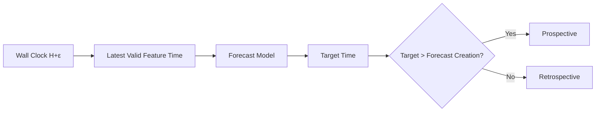

# Live Forecast Timing Contract V1

## Decision

**`RETRAIN_T2H_WITH_COMPLETED_HOUR_INPUT`**. Keep the live feature cutoff at the latest completed UTC hour. Train a new model whose target is exactly two hours after `feature_time`; do not relabel the frozen V1 target. At wall clock `17:05Z`, feature time `16:00Z` then targets `18:00Z`, leaving a 55-minute positive forecast lead.

This is a design decision only. The producer, inference job, frozen model, and validation cohort were not changed or run in this phase.

## Existing Contract and Blocker

The producer computes `safe_hour = floor(now_utc_hour) - 1h`, selects a common provider hour no later than that cutoff, and requests the current provider hour only so it can filter it out until the hour is closed. Inference sets `target_time = feature_time + 1h` and records its actual inference timestamp.

At `17:05Z`, the current contract therefore uses `feature_time=16:00Z`, targets `17:00Z`, and creates the forecast at about `17:05Z`: `lead_seconds = target - created = -300`. It is retrospective. The prior live run likewise recorded target-time-passed forecasts; it was backfill evidence, not a prospective cohort.

## Provider and Training Semantics

Training rows came from Open-Meteo `/v1/archive` with no explicit `models` parameter. Open-Meteo describes Historical Weather as reanalysis and its default Best Match as a seamless combination of IFS HRES, ERA5, and ERA5-Land. The live producer calls `/v1/forecast` with no `models` parameter; Forecast Best Match combines operational forecast models. The repository's prior comparison records equal field names/units but `semantics_identical=false`.

| Variable | Historical Archive valid time | Live Forecast valid time | Availability / assessment |
|---|---|---|---|
| `temperature_2m` | Instant at `t` | Instant at `t` | The `t` row was returned in the probe; live value is model output, not an observation. Timestamp semantics align; source vintage differs. |
| `relative_humidity_2m` | Instant at `t` | Instant at `t` | Same qualification as temperature. |
| `precipitation` | Sum over preceding hour `[t-1h,t]` | Sum over preceding hour `[t-1h,t]` | At `17:05Z`, the `17:00Z` interval has ended. The returned live value is still a model estimate, not a measured accumulation. |
| `pressure_msl` | Instant at `t` | Instant at `t` | Timestamp semantics align; source vintage differs. |
| `wind_speed_10m` | Instant at `t` | Instant at `t` | Timestamp semantics align; source vintage differs. |
| `wind_gusts_10m` | Generic Archive docs say instant at `t`; semantics can vary by underlying model | Maximum over preceding hour | Model-dependent Archive Best Match is not pinned, so equivalence is not established. |
| `weather_code` | Instant code derived from weather fields | Instant code derived from forecast fields | Preserved context, not one of the 73 numerical model features; source product differs. |

The feature specification labels source values “observed,” but the historical downloader uses `/v1/archive`, which returns reanalysis rather than station observations. That wording must not be read as station ground truth. Open-Meteo recommends its Historical Forecast API when training predictor features that should match live Forecast API model output; a later modeling phase should pin that feature source and document its target source.

## Live Probe

At `2026-10-03T06:27:17Z`, a direct `/v1/forecast` request for Hanoi (`21.0285, 105.8542`, `timezone=UTC`) returned hourly rows `04:00Z`, `05:00Z`, and `06:00Z`, including all seven requested variables at `06:00Z`. Thus a current-hour row was available 27 minutes into that hour in this probe. This confirms one response, not an every-location or every-minute availability guarantee.

The current-hour row can be causally available for a forecast issued during the hour, and its precipitation/gust fields describe the preceding interval. But current live Forecast Best Match values are not proven semantically equivalent to the Archive Best Match values used by the frozen model; gust is explicitly model-dependent. So retaining the frozen model with current-hour inputs is not accepted as a no-compromise contract.

## Candidate Timing

| Contract | Wall clock | Feature time | Model horizon | Target | Lead at creation | Prospective? | Retraining? |
|---|---:|---:|---:|---:|---:|---|---|
| Current implementation | `17:05Z` | `16:00Z` | `+1h` | `17:00Z` | `-300s` | No | No, but retrospective |
| A — current-hour input | `17:05Z` | `17:00Z` | `+1h` | `18:00Z` | `+3300s` | Yes by time | No if frozen model is reused; semantic compatibility is unproven |
| B — completed-hour input | `17:05Z` | `16:00Z` | `+2h` | `18:00Z` | `+3300s` | Yes | Yes |

Candidate B is selected because it preserves the completed-hour feature rule and makes the model's target match its training horizon exactly. A `+2h` model issued five minutes into hour `H` from feature time `H-1` forecasts `H+1`, which is about 55 minutes in the future. The feature-to-target horizon is two hours; the wall-clock forecast lead is about 55 minutes.

Required future target: `target_temperature_2h = temperature at exactly feature_time + 2 chronological hours in the same location`. Lags and trailing rolling windows must end at the completed feature hour and use only its contiguous prior history. No timestamp shifting or target relabeling is allowed.

## Next Milestone

`Weather Forecast Modeling V1.1 — +2h Horizon`. Define and pin historical predictor and target sources, construct the exact `+2h` label, retrain and freeze a new model, validate offline parity, then run the prospective live cohort. Keep `validation/prospective-live-model-v1` as blocked evidence; do not merge it as a successful validation.

## Evidence and Limitations

The probe is a single current-hour response. Provider documentation does not promise that every current-hour row will be available at a fixed minute offset. Archive Best Match does not record its selected model in the training rows, and the wind-gust definition can vary across models. The timing decision is therefore based on strict causal publication plus completed-hour inputs, with training/live source pinning required in V1.1.

Persisted evidence: `results/live-forecast-timing/20261003T062717Z-live-forecast-timing-v1/`.
