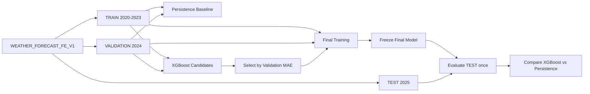
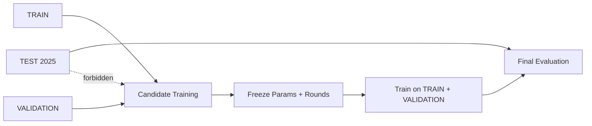

# Weather Forecast Modeling V1

## Objective and scope

This phase compares one nationwide global XGBoost regressor with the official persistence forecast for same-location temperature at `t + 1 hour`. The persistence prediction is exactly `temperature_c(t)`. Acceptance is based on the untouched 2025 TEST comparison, with validation used for all model selection.

This phase does not change feature engineering, Delta, Parquet, temporal splits, or streaming. It does not add another horizon, per-location models, online inference, a forecast API, alerts, dashboards, or deployment.

## Dataset and feature contract

The input is `data/ml/weather_forecast_fe_v1/`, feature set `WEATHER_FORECAST_FE_V1`, with 3,312,729 rows from 63 locations. Expected rows are TRAIN 2,207,457, VALIDATION 553,392, and TEST 551,880. Each 2025 TEST location has 8,760 rows.

The exact ordered input names come from `feature_manifest.json:model_features`, and are checked against `feature_spec.json:model_features` in the same order and against `ml_schema.json`. In the frozen feature artifacts, this membership is represented by the `model_features` arrays; feature-spec entries use `role: "feature"`, not the literal string `MODEL_FEATURE`. The loader records this mapping and fails on a mismatch. It never rebuilds the feature list from source code or Parquet column order.

The 73 inputs are numeric and include the existing current, calendar, lag, rolling, and change features. The target is `target_temperature_1h`. `location_id`, `event_time`, `target_time`, `weather_code`, `split`, and other context or identity fields remain outside the model matrix. In particular, location IDs are not ordinally encoded and timestamps are not converted to epoch features.

Before model work, the loader verifies checksums of the frozen small FE reports, the exact 15-file / 367,979,619-byte Parquet inventory, Parquet footer row counts, the split partition, and the ML schema. The prior feature-validation artifact reports zero null, NaN, and infinite model inputs per split and is itself checksum-verified. TRAIN and VALIDATION values are read in Arrow batches; TEST values are not materialized during candidate selection.

## Temporal evaluation and model selection

The split is target-time based: TRAIN is before 2024, VALIDATION is 2024, and TEST is 2025. No random split or cross-validation is used.

The baseline and XGBoost use the same centralized definitions:

- MAE: mean absolute prediction error.
- RMSE: square root of mean squared prediction error.
- R²: `1 - residual_sum_squares / total_sum_squares` (undefined as JSON `null` for a constant target).
- Bias: mean of `prediction - actual`.

Candidate profiles are a small deterministic set: five when a GPU passes both `nvidia-smi` and a tiny XGBoost CUDA probe, or three on CPU. All candidates use `reg:squarederror`, `mae`, `hist`, seed 42, at most 2,500 rounds, and 100-round early stopping on the full 2024 VALIDATION split. A CUDA resource failure retries the same candidate on CPU and records the fallback. Successful candidates are checkpointed to Drive after each run and skipped on resume when their parameter record matches.

Selection sorts by validation MAE, then validation RMSE, then `best_boost_rounds * max_depth` as a simple size proxy, then training time. TEST is not part of this ranking. The selected candidate and its metrics are written to `selected_candidate.json` before final fitting.

The final fit combines all 2,207,457 TRAIN rows and all 553,392 VALIDATION rows, for 2,760,849 rows total. It uses exactly `best_iteration + 1` rounds and has no TEST eval set or early stopping. The model is saved, hashed, reloaded into a fresh XGBoost Booster, and sample predictions are compared before TEST is opened.

## TEST isolation and reporting

After the final model hash and reload check are saved, TEST is loaded once for official evaluation. TEST location counts and target-time alignment are checked after freeze. XGBoost and persistence metrics use the same rows. A completion marker prevents a completed test evaluation from running a second time on notebook resume; an interrupted evaluation is recorded before a documented recovery attempt.

The report includes overall baseline and model metrics, absolute and percentage MAE/RMSE gains, and per-location MAE/RMSE/R²/bias for all 63 locations. Location summaries count improved, tied, and worse MAE cases and list the ten worst XGBoost MAEs and ten largest regressions descriptively. No TEST observation is used to retune the model.

Gain and split-weight importance are persisted. The notebook saves actual-vs-predicted, error-distribution, per-location-MAE, and feature-importance charts. It also writes `test_predictions.parquet` to Drive with location, event/target times, actual values, both predictions, and both errors. It is excluded from Git.

## Artifacts and reproducibility

Run-scoped output is stored in `MyDrive/weather-streaming-bigdata/artifacts/weather_forecast_xgboost_v1/<run_id>/`. Run IDs use UTC. An active run ID is reused after a disconnect until a successful manifest marks that run complete; a completed run is never overwritten.

The Drive run contains candidate checkpoints, selected parameters, feature list and hash, dataset verification, baseline/model metrics, per-location metrics, importance, training environment and manifest, model JSON and SHA-256, reload validation, prediction Parquet, plots, and result checksums. Only small reports and checksums are copied under `results/modeling/<run_id>/`; model binaries and prediction Parquet remain on Drive. `.gitignore` also excludes those large artifacts if copied locally by mistake.

Run `notebooks/weather_forecast_xgboost_v1.ipynb` in Colab from top to bottom. It checks out the current `model/weather-forecast-xgboost-v1` branch, records the exact clean Git commit as `training_code_commit`, mounts Drive through the Google authorization UI, verifies the dataset, and captures actual Python/XGBoost/NumPy/Pandas/PyArrow/scikit-learn versions and hardware.

## Modeling flow

## TEST isolation

## Limitations and next step

This is a single global tree model trained on the frozen 73-feature contract. It does not encode `location_id` categorically. The curated search is intentionally small, one deterministic validation year chooses the candidate, and location-level results are descriptive. One official test result does not establish production robustness, inference latency under load, or live feature-state correctness.

If the frozen model meaningfully beats persistence, the next milestone is **Streaming Weather Forecast Inference V1**. If it does not, the next milestone is **Weather Forecast Modeling V1.1**. Neither streaming inference nor test-driven retuning is part of V1.
