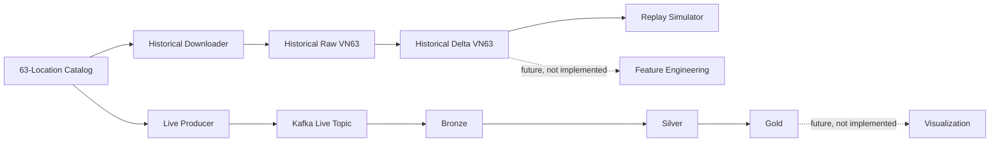
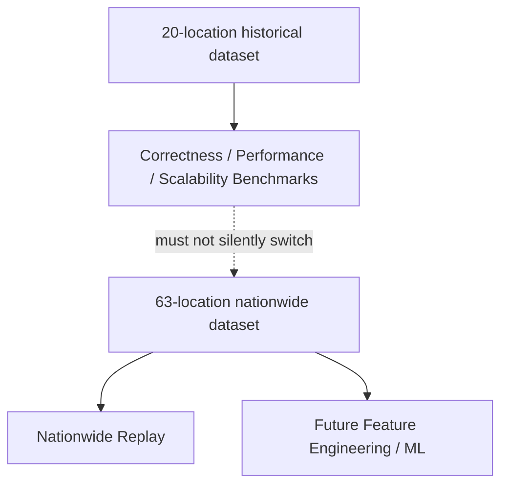

# Nationwide Weather Dataset

## Scope and administrative snapshot

`NATIONWIDE_63` expands the historical weather coverage to the 63 provincial-level units immediately before the 2025 consolidation. The catalog freezes this boundary as `VN_63_PRE_2025_MERGER`: 6 centrally governed cities and 57 provinces. `Huế` is the canonical name; `Thừa Thiên Huế` is retained only as an alias for the same continuing geographic series. This dataset does not define mappings to the later 34-unit structure.

Each province or city has exactly one WGS84 representative coordinate. It is an urban representative point, usually the administrative capital or principal city, and is not a province polygon centroid or a claim of sub-province microclimate coverage. New coordinates are sourced from Open-Meteo's GeoNames-backed geocoding service; the catalog records the selected representative place and source. Coordinate precision is kept at a practical decimal level. The original 20 IDs, names, and numeric coordinates are unchanged.

| Added canonical unit | Representative place |
|---|---|
| Bắc Giang | Bắc Giang |
| Bắc Kạn | Bắc Kạn |
| Bạc Liêu | Bạc Liêu |
| Bắc Ninh | Bắc Ninh |
| Bến Tre | Bến Tre |
| Bình Dương | Thủ Dầu Một |
| Bình Phước | Đồng Xoài |
| Cao Bằng | Cao Bằng |
| Đắk Nông | Gia Nghĩa |
| Điện Biên | Điện Biên Phủ |
| Đồng Tháp | Cao Lãnh |
| Hà Giang | Hà Giang |
| Hà Nam | Phủ Lý |
| Hà Tĩnh | Hà Tĩnh |
| Hải Dương | Hải Dương |
| Hậu Giang | Vị Thanh |
| Hòa Bình | Hòa Bình |
| Hưng Yên | Hưng Yên |
| Kon Tum | Kon Tum |
| Lai Châu | Lai Châu |
| Lạng Sơn | Lạng Sơn |
| Lào Cai | Lào Cai |
| Long An | Tân An |
| Nam Định | Nam Định |
| Ninh Bình | Ninh Bình |
| Ninh Thuận | Phan Rang - Tháp Chàm |
| Phú Thọ | Việt Trì |
| Phú Yên | Tuy Hòa |
| Quảng Bình | Đồng Hới |
| Quảng Nam | Tam Kỳ |
| Quảng Ngãi | Quảng Ngãi |
| Quảng Trị | Đông Hà |
| Sóc Trăng | Sóc Trăng |
| Sơn La | Sơn La |
| Tây Ninh | Tây Ninh |
| Thái Bình | Thái Bình |
| Thái Nguyên | Thái Nguyên |
| Tiền Giang | Mỹ Tho |
| Trà Vinh | Trà Vinh |
| Tuyên Quang | Tuyên Quang |
| Vĩnh Long | Vĩnh Long |
| Vĩnh Phúc | Vĩnh Yên |
| Yên Bái | Yên Bái |

## Catalog and identity

`historical/locations.json` is the single canonical catalog used by catalog validation, historical downloading, and the live producer. Each entry contains a stable `location_id`, Vietnamese `province_name`, ASCII join label, `admin_type`, `representative_place`, `latitude`, `longitude`, `country_code=VN`, `timezone=UTC`, `admin_snapshot`, aliases, dataset memberships, and coordinate provenance. The 20 existing entries belong to both `BENCHMARK_20` and `NATIONWIDE_63`; the 43 additions belong only to `NATIONWIDE_63`.

The catalog validator checks the exact 63 canonical names, 6/57 administrative-type split, unique IDs and names, unique coordinate pairs, WGS84 ranges, Vietnam representative-center sanity bounds, snapshot metadata, and preservation of the old 20 IDs. Its run-scoped JSON includes the catalog SHA-256.

## Historical observations

The source remains the Open-Meteo Historical Weather API and keeps the existing hourly variables and field meanings: `temperature_2m`, `relative_humidity_2m`, `precipitation`, `pressure_msl`, `wind_speed_10m`, `wind_gusts_10m`, and `weather_code`, converted to the existing event schema. The requested interval is `2020-01-01T00:00:00Z` through `2025-12-31T23:00:00Z`, stored in UTC. No provider mixing, imputation, feature engineering, local-time conversion, or schema expansion is part of this milestone.

The expected hours per location are 8,784 in 2020, 8,760 in each of 2021–2023, 8,784 in 2024, and 8,760 in 2025: 52,608 per location. For 63 locations the expected total is 3,314,304 records, with annual totals 553,392; 551,880; 551,880; 551,880; 553,392; and 551,880. Reusing the original 20 leaves 43 × 52,608 = 2,262,144 new location-hours to fetch.

The downloader requests deterministic batches of at most 10 coordinate pairs per year. Ten coordinates bound URL length while reducing request count compared with one request per province. It verifies the response count and maps response positions back to the ordered catalog IDs. Each location-year is independently resumable; a structurally validated unit is retained under staging, requests use bounded retries and backoff, and `.partial` files are promoted only after validation. Final yearly gzip files are merged deterministically by `(event_time, location_id)`. Failed location-year units and retry counts are written to the download manifest. The 20 old annual gzip files remain at `data/historical/raw`; the isolated VN63 output is `data/historical/nationwide_63/raw`, with resumable staging under `data/historical/nationwide_63/staging/units`.

Raw validation checks expected versus actual totals, exact absent hourly timestamps, duplicate event IDs and observation keys, unknown IDs, null identity fields, deterministic sort order, UTC hourly timestamps, event-ID derivation, and the existing Silver-compatible temperature, humidity, precipitation, and coordinate ranges. Missing provider observations remain missing and are listed by location and year; no values are fabricated. The per-location and per-year CSV/JSON reports make incomplete coverage explicit.

## Delta and runtime paths

`historical_to_delta.py --dataset nationwide-63` reads VN63 raw data and writes a separate Delta target at `/opt/project/data/historical/weather_hourly_vn63`. The original `benchmark-20` default remains `/opt/project/data/historical/weather_hourly`. Both retain the existing `year` partition column and weather-quality filters. Conversion writes a row-count, unique-ID, location-coverage, and UTC-time-range report before the result is treated as validated.

The historical simulator accepts `--dataset benchmark-20` or `--dataset nationwide-63`; an explicit `--source` override remains available. The benchmark runner explicitly pins `benchmark-20` and its original source path. Live producer batches also come from the canonical 63-location catalog, retains the 10-second poll interval and Kafka key `location_id`, and validates response cardinality before assigning observations. Failed batches are logged with their IDs and poll timestamp; successful batches may still publish, but no stale or fabricated rows are emitted. A complete poll therefore contains one current observation per catalog location.

## Benchmark isolation

The pre-existing 20-location raw dataset and benchmark artifacts remain the reproducibility source. New nationwide files and the separate Delta target do not replace them. No benchmark performance or scalability scenarios are run as part of this data coverage milestone; B0 correctness, when run, continues to use the 20-location source.

## Limitations and handoff

One point per province or city is an approximation; it does not represent within-province climate variation. `NATIONWIDE_63` uses the frozen 63-unit boundary through the 2020–2025 time series, including the single continuous Huế series. Provider gaps, if present, are reported as exact missing UTC timestamps. The expanded row count is data coverage, not a standalone performance or scalability claim.

This dataset is a future input for Spark feature engineering, an ML-ready export, Colab training, streaming inference, and later map visualization. None of those follow-on products, lag/rolling features, labels, train/validation/test splits, models, or GeoJSON joins are implemented here. The next milestone begins only after review: Spark feature engineering for weather forecasting.

## Official provider references

- [Open-Meteo Geocoding API](https://open-meteo.com/en/docs/geocoding-api) documents the location lookup service and its GeoNames source.
- [Open-Meteo Historical Weather API](https://open-meteo.com/en/docs/historical-weather-api) documents archive variables and multi-coordinate requests.
- [Open-Meteo Forecast API](https://open-meteo.com/en/docs) documents current-condition variables and multi-coordinate responses for the live producer.
