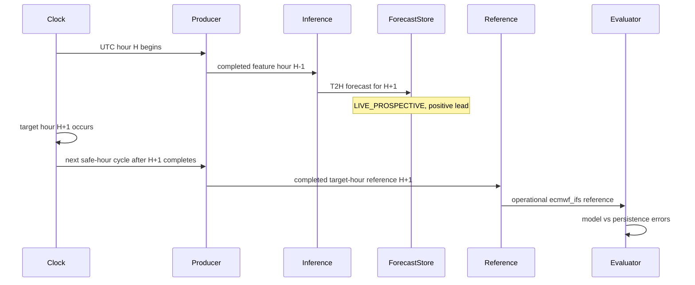
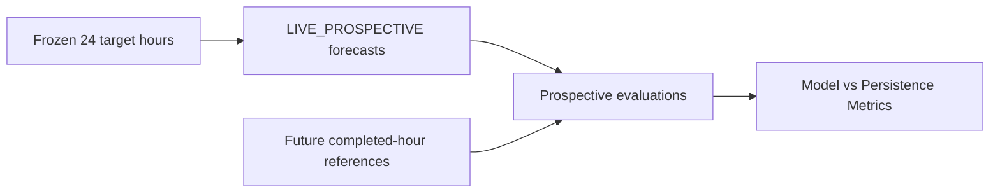

# Prospective Live Model Validation V1 — T2H

## Objective and frozen contract

This phase measures the already trained canonical T2H XGBoost model against a later live Open-Meteo operational reference and against persistence. It does not train or tune a model. The offline training target remains ERA5 reanalysis; the immediate prospective reference is an operational model product and is not station ground truth.

| Contract item | Frozen value |
| --- | --- |
| Model | `WEATHER_XGBOOST_GLOBAL_T2H_V1_1` |
| Model SHA-256 | `bd5ee153b2709ac661557bdd11f8322b80de1264c65a27d1d6c79fbcf63ee66a` |
| Feature set | `WEATHER_FORECAST_FE_T2H_V1_1` |
| Feature count | `73` |
| Feature-list SHA-256 | `20a5d2fb56d9b7231f4c43b39ad7a833298d76b1bfd0f127b2b251c57e5d7fd2` |
| Provider/model | Open-Meteo Forecast API / `ecmwf_ifs` |
| Horizon | exactly 2 hours |
| Cohort | 24 consecutive target hours × 63 canonical locations = 1,512 slots |
| Origin | `LIVE_PROSPECTIVE` |

At every validation runner start, the model bytes, feature-list artifact, IDs, feature count, provider model, and horizon are checked. The in-process collector repeats the runtime check while the cohort is active. Drift is recorded as `COHORT_CONTRACT_DRIFT` and prevents finalization.

The inference contract stays unchanged: the producer supplies the latest completed safe hour `F`; inference targets `F + 2h`; `forecast_lead_seconds` is `target_time - inference_time` and must be positive. Replay, backfill, wrong-source, invalid-lead, wrong-horizon, and noncanonical-location rows cannot enter the cohort.

## Cohort freeze and time window

The runner first persists an official start request. It freezes T0 at the earliest target time with a complete, valid, 63-location `LIVE_PROSPECTIVE` cycle whose inference and post-Delta persistence confirmation are both after that request. It writes the manifest before processing the 24-hour window:

```text
T0, T0 + 1h, ... T0 + 23h
```

The window is immutable after freeze. Missing forecasts, poor skill, outages, and later weather conditions do not move it. Twenty-four target hours can take 25–26+ wall-clock hours because a target-hour reference is only available after that hour completes and the producer retrieves it.

The forecast grace is 15 minutes after each issuance boundary (`target_time - 1h`). The live producer polls every five minutes, so this allows three polling intervals before an absent location-hour becomes `FORECAST_MISSING`. The reference grace is two hours after target time: one hour to cross the next completed-hour safe-hour boundary, plus one hour for normal pipeline delay or recovery. Both values and their rationale are stored in `start_request.json` and the frozen manifest.

## Reference and evaluation policy

For a slot to be evaluated, the reference must have the same `location_id` and exact `target_time`, source `OPEN_METEO_LIVE_HOURLY`, provider `Open-Meteo`, endpoint `/v1/forecast`, model `ecmwf_ifs`, and a source retrieval time at least one hour after the event hour. The collector does not interpolate or select a neighboring hour.

Persistence is the temperature in the feature-time observation. The existing monitoring evaluator computes both models against the same target reference and preserves completed evaluations. A later payload change is written to the reference revision audit and does not replace a first-wins evaluation.

The reference is an operational forecast product, not a station measurement. Prospective scores must not be described as scientifically identical to offline ERA5 TEST scores. The eventual result covers only 24 target hours across one short weather regime and is not a long-term nationwide guarantee.

## Timeline



## Cohort flow



## Persistence, restart, and outage handling

The official request, frozen manifest, slot matrix, status, outage estimates, contract checks, and preflight result live outside Git at `data/runtime/prospective-live-t2h-168h-v1/<RUN_ID>/`. Forecasts, Spark checkpoint, state Delta, persistence receipts, and revision records are isolated by the same run ID. Restarting the runner or Docker services resumes that ID and checkpoint; it cannot silently create a new T0.

Immediately after the forecast Delta MERGE, the inference job records an idempotent receipt with the contract-record SHA and UTC completion time. If a driver stops after the Delta commit but before the receipt append, a later replay records a conservative post-MERGE confirmation time and marks it `RECOVERED_POST_MERGE_CONFIRMATION`; this is an upper-bound confirmation for issuance latency. The receipt is not inferred from `inference_time`.

The collector estimates outages from gaps between successful microbatch updates and records their timing quality. Docker live services use `restart: unless-stopped`; the `resume` command explicitly reuses the active run ID and records longer gaps. Missing prospective slots remain missing, even if a later replay or backfill creates a separate row.

## Status and commands

Use the project virtual environment so the same Python runtime executes preflight and regression tests:

```powershell
.\.venv\Scripts\python.exe -m validation.prospective_t2h preflight
.\.venv\Scripts\python.exe -m validation.prospective_t2h readiness
.\.venv\Scripts\python.exe -m validation.prospective_t2h start
.\.venv\Scripts\python.exe -m validation.prospective_t2h status
.\.venv\Scripts\python.exe -m validation.prospective_t2h resume
.\.venv\Scripts\python.exe -m validation.prospective_t2h finalize
```

`preflight` must pass compileall, the full pytest suite, `git diff --check`, and `docker compose --profile t2h-live config --quiet`. `readiness` runs an isolated cycle and requires all 63 forecasts, positive lead, exact +2h offset, pinned provider/model, valid persisted receipts, and acceptance by the monitoring evaluator. Readiness records are stored outside the official cohort. `start` requires the preflight and a fresh readiness result for the same runtime-contract fingerprint.

`status` reads persisted cohort state and reports the frozen T0–T23 window, forecast slots, evaluations, pending target/reference slots, missing slots, conflicts, and completed target hours. Interim metrics are labeled `INTERIM`. Finalization occurs only after every slot is terminal: `EVALUATED`, `FORECAST_MISSING`, `MISSING_REFERENCE`, `REFERENCE_CONFLICT`, or `INVALID` (with a recorded reason).

## Metrics and evidence

The final collector writes `results/prospective-live-t2h/<RUN_ID>/` with the cohort manifest/status, model/provider checks, hourly completeness, issuance SLO, lead and reference/evaluation latency distributions, the prospective evaluation Parquet, overall metrics, per-location and per-target-hour metrics, missingness, duplicate/provenance checks, reference revision audit, delayed ERA5 manifest, runtime summary, regression-test evidence, and checksums. Parquet rows include forecast and persistence predictions, target reference, errors, timing, model/feature identity, source provenance, and terminal status.

The issuance SLO is measured as `forecast_persisted_at - (feature_time + 1h)`. A cycle passes only when all 63 locations have persisted forecasts within 60 seconds. Forecast lead, reference-arrival lag, and evaluation lag are separate distributions. Aggregate XGBoost and persistence MAE, RMSE, R², and bias use the same valid evaluations. Reports also contain MAE/RMSE improvements, MAE skill, per-location and per-hour comparisons, and all missing/invalid counts.

Completeness and skill are independent. `COMPLETE_1512` requires 1,512 valid forecasts and evaluations; a finalized window with absent/invalid slots is `COMPLETE_WINDOW_WITH_MISSINGNESS`; an unfinished window is `VALIDATION_INCOMPLETE`. Skill is `POSITIVE_PROSPECTIVE_SKILL` only when both aggregate MAE and RMSE beat persistence, `MIXED_PROSPECTIVE_SKILL` when exactly one does, `NO_PROSPECTIVE_SKILL_VS_PERSISTENCE` when neither does, or `INSUFFICIENT_VALID_EVALUATIONS` when there are too few valid scores.

The delayed ERA5 manifest identifies the cohort and required location, feature-time, target-time, model-prediction, and persistence-prediction fields for future exact-time research. ERA5 retrieval is not part of this phase and cannot replace the immediate operational reference.

## Result state

The document and runner are prepared before the official cohort starts; no measured cohort result is asserted here. The final report must answer the exact protocol, count, metric, SLO, resume, completeness, skill, merge-readiness, and retraining questions in the phase request. Do not merge or create a validation tag. Push only after the 1,512 slots are terminal and evidence is prepared; retain human review before merge.
