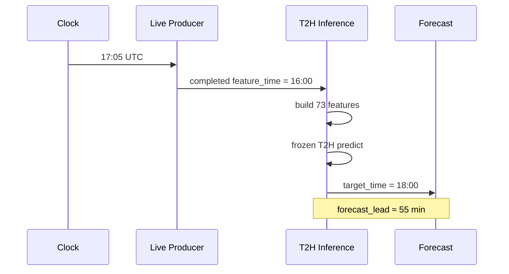

# Streaming Forecast Inference V1.1 — T2H

## Purpose and frozen identity

The completed-hour streaming contract makes a one-hour-ahead target stale by the time inference runs. T2H predicts the temperature two hours after the latest safe, completed feature hour, so a forecast can still target a future hour with positive operational lead.

This is inference-only. The canonical Colab artifact is `WEATHER_XGBOOST_GLOBAL_T2H_V1_1`, SHA-256 `bd5ee153b2709ac661557bdd11f8322b80de1264c65a27d1d6c79fbcf63ee66a` (27,726,327 bytes), with feature set `WEATHER_FORECAST_FE_T2H_V1_1`, 73 ordered features, and frozen feature-list SHA-256 `20a5d2fb56d9b7231f4c43b39ad7a833298d76b1bfd0f127b2b251c57e5d7fd2`. The source is canonical Colab run `20261003T122405Z-xgb-t2h-v1-1-colab` (Tesla T4). No model training or fitting is part of this milestone.

The model file is loaded as a CPU XGBoost Booster by the isolated T2H loader. Startup checks verify file size, SHA, XGBoost version, feature names/order, finite probe input and finite prediction. Docker mounts the model read-only. The ignored local artifact used for this run is `results/modeling-t2h/20261003T122405Z-xgb-t2h-v1-1-colab/weather_forecast_xgboost_t2h_v1_1.json`.

## Live source and completed-hour contract

The T2H live producer calls the Open-Meteo Forecast API (`https://api.open-meteo.com/v1/forecast`) with the explicit `models=ecmwf_ifs` parameter. Each observation carries provider, endpoint, model, retrieval time, coordinates, source and source event ID. The V1 producer default remains unchanged when no model is specified.

For a wall clock in hour H, inference accepts no feature hour newer than H−1. It builds each location's ordered 73-feature vector from contiguous observations only; state retains enough history for warmup and rolling features. The first forecast-ready vector follows 24 observations of warmup. Missing-hour windows are marked `GAP_IN_HISTORY` and cannot produce a forecast until a contiguous history window is available again. Duplicate observations are reduced by location and event hour before features are built.

The T2H target is always `target_time = feature_time + 2 hours` (7,200 seconds). A live record is `LIVE_PROSPECTIVE` only when the source is the pinned live hourly endpoint and the target is later than inference time. Such rows record `forecast_lead_seconds`; nonpositive lead rows are skipped. An optional minimum useful lead is separately configured and reported. No minimum useful lead threshold is configured by default; temporal validity remains the hard gate.

## Replay, idempotency and storage

Historical validation uses Open-Meteo's Historical Forecast API, explicitly pinned to ECMWF IFS, and is labeled `REPLAY_VALIDATION`. Backfill is labeled `BACKFILL`. Neither origin is eligible for a prospective live cohort. Forecast IDs are deterministic over model, location, feature time and target time. Replay uses a separate topic, state and checkpoint from live, while the Delta record preserves origin and source provenance. Delta writes are idempotent by forecast ID.

The canonical 72-hour replay covers 63 locations (4,536 observations). It produces 3,024 eligible forecast records after 1,512 warmup observations. A restart test resends overlapping input against the same checkpoint and state: overlap is deduplicated and existing logical forecasts are not written again. The read-only Delta audit checks forecast IDs and logical keys, 7,200-second target offsets, contract identity, origins, live leads, location coverage and persisted state.

## Feature and prediction parity

Offline and online replay compare the same ordered 73 features and the frozen CPU model. All features except one rolling standard-deviation artifact are within `1e-9`; the maximum absolute difference is `8.875828712007205e-06` in `pressure_roll_std_3h` at `VN_HANOI`, `2025-01-03T21:00:00Z`. The canonical offline Pandas `rolling.std(ddof=0)` returns approximately `8.8758e-06` for three identical pressure values because of floating-point cancellation, while the streaming calculation returns approximately zero for a mathematically constant window. This named feature has a documented, narrowly scoped tolerance of `1e-5`; it is not a general feature tolerance relaxation. All 3,024 prediction outputs match exactly after the canonical float32 model-input conversion (maximum difference `0.0 °C`).

## Monitoring compatibility

The evaluator accepts the T1H and T2H model/feature identities without changing the T1H default. T2H records are validated for horizon, model/feature hashes, source provenance, execution origin and positive lead for live forecasts. Replay and backfill origins stay outside the prospective cohort even if other source fields resemble live data. A live smoke verifies issuance and provenance only; it does not establish forecast accuracy. The future prospective evaluation will use a complete target hour and an eligible live reference under the evaluator's existing reference semantics.

## Architecture

```mermaid
flowchart LR
    API["Open-Meteo Forecast API<br/>models=ecmwf_ifs"]
    OBS["Completed Hourly Observations"]
    STATE["Per-location State<br/>24h+ history"]
    FE["73 Features<br/>Exact T2H Contract"]
    MODEL["Frozen XGBoost T2H<br/>SHA bd5ee153..."]
    FC["Forecast<br/>target = feature + 2h"]
    STORE["Forecast Delta"]
    MON["Monitoring"]

    API --> OBS
    OBS --> STATE
    STATE --> FE
    FE --> MODEL
    MODEL --> FC
    FC --> STORE
    STORE --> MON
```

## Issuance timing

## Known limitations and next phase

Replay is retrospective and has no historical issuance vintage. Feature parity contains the explicitly bounded rolling-standard-deviation numerical artifact described above. The live smoke establishes source pinning, schema and positive issuance lead, not predictive accuracy. The proposed issuance SLO (all 63 forecasts within about 60 seconds after a UTC hour begins) was not measured: bootstrap was started mid-hour. The measured available-now inference batch is about 48 seconds, which does not establish the end-to-end SLO. The optional forecast Kafka output remains disabled; Delta is the persisted forecast sink. GitNexus's Python symbol coverage may be incomplete for dynamic/cross-language edges, so direct source checks and tests complement graph analysis.

The next phase is **Prospective Live Model Validation V1 — T2H**: collect 24 complete target hours × 63 locations = 1,512 canonical evaluations, admitting only `execution_origin=LIVE_PROSPECTIVE`, the frozen model SHA, and `forecast_lead_seconds>0`. Replay, backfill and retrospective forecasts must be excluded. Do not run that validation in this inference milestone.
