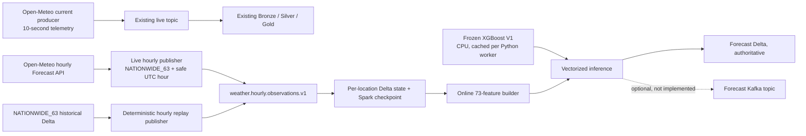
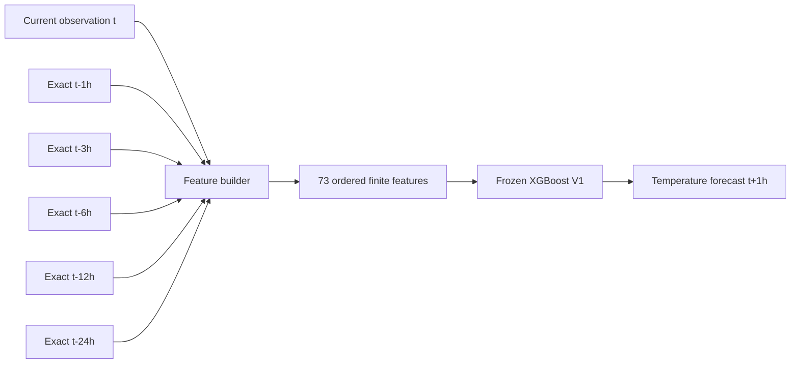
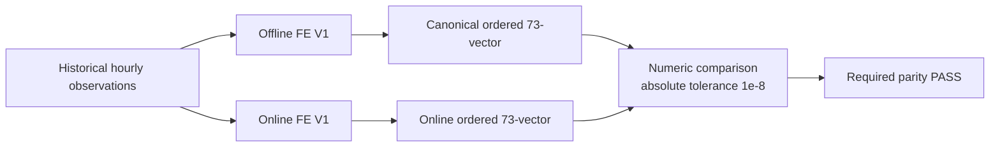

# Streaming Weather Forecast Inference V1

## Frozen model and feature contract

This phase serves the already-trained `WEATHER_XGBOOST_GLOBAL_T1H_V1` model. It does not train, tune, or alter the model. At startup, the job requires the canonical model SHA-256 `07fffbaed3e4934017a03135eddba8fc200fbcd22b799d246ea816695f98704a`, a file size of 51,662,443 bytes, XGBoost 3.4.1, the `WEATHER_FORECAST_FE_V1` feature set, and the ordered 73-feature list with SHA-256 `ec716f47ac4eca99a945a2ba1c50ba1297c1509a2aa5f80cff063042e40295bf`.

The JSON model is local and ignored by Git at `data/models/weather_forecast_xgboost_v1/weather_forecast_xgboost_v1.json`. Docker Compose makes the model visible to driver and workers under `/opt/project/history-data`, and the Spark containers use a pinned Python 3.12.15 runtime with `xgboost==3.4.1`. XGBoost runs on CPU. Each Python worker process lazily loads and verifies one Booster, then predicts a Pandas batch with the canonical feature names and order.

## Input contract and live cadence

The inference topic is `weather.hourly.observations.v1`. Each record represents one cleaned observation for one canonical `location_id` at one exact UTC hour. The JSON fields are `event_id`, `location_id`, `city`, `latitude`, `longitude`, `event_time`, `temperature_c`, `humidity_pct`, `precipitation_mm`, `pressure_hpa`, `wind_speed_kmh`, `wind_gust_kmh`, `weather_code`, and `source`.

The existing Open-Meteo current-conditions producer remains on its 10-second `weather.raw` path for the existing telemetry and Bronze/Silver/Gold flow. Its `current.time` records are not canonical hourly observations and must not populate the model's hourly lag or rolling features. Live inference now uses the separate [Live Hourly Observation Pipeline V1](LIVE_HOURLY_OBSERVATION_V1.md), which requests completed UTC hourly values for the canonical 63 locations and publishes a 24-hour lookback bootstrap (25 observations including the feature hour) plus the safe current hour to `weather.hourly.observations.v1`. The historical replay publisher remains available on that inference topic as a separate validation source.

Open-Meteo documents current conditions as being based on 15-minute model data ([Forecast API documentation](https://open-meteo.com/en/docs)). The 10-second poll can therefore see the same provider timestamp on repeated requests. The producer forms `event_id` from `(location_id, event_time)`, and Silver deduplicates that exact ID within its 10-minute watermark. Silver does not aggregate by UTC hour: distinct provider timestamps that fall within one hour can remain as multiple rows for a location. No live Silver row-count sample was collected during this replay, so this describes the source and deduplication contract rather than a measured live row count.

For the acceptance replay, `publish-replay --hours 72` validates the complete NATIONWIDE_63 Delta source, selects the first deterministic 72-hour range, verifies exactly one row for every location-hour (4,536 rows), and publishes that window to the inference topic. It never changes the benchmark-20 source or producer path.



## Online feature state and semantics

The state Delta table stores canonical weather observations keyed by `(location_id, event_time)`. Per micro-batch, Spark validates the UTC-hour timestamp, canonical location ID, geographic coordinate ranges, and finite weather inputs; identical duplicates collapse, conflicting duplicates and unknown locations are rejected to a separate Delta path. Coordinates are preserved from the input rows because these are the values used by the frozen training features. The current administrative catalog's representative coordinates differ from some coordinates in the historical training source, so the replay contract verifies one stable coordinate pair per location in the source instead of replacing or comparing those model inputs with newer catalog centers. Rows are grouped by `location_id` and sorted by `event_time` before feature generation. A bounded 48-hour window is retained (up to 49 inclusive hourly rows per location).

The first forecast needs 24 prior hourly rows plus the current observation: 25 contiguous observations. No missing lag is filled. A gap returns `HISTORY_GAP` until 25 contiguous hourly timestamps are available again; a cold location returns `INSUFFICIENT_HISTORY`. Events later than the retained 48-hour state horizon are rejected as `LATE_BEYOND_STATE_RETENTION`. Temporal operations are isolated by location.

Gap replay counters are summed across microbatch status assessments, not counted as mutually exclusive classifications of unique input keys. As state grows, a prior candidate can be scored again and its status can change from `INSUFFICIENT_HISTORY` to `HISTORY_GAP` or `READY`. In the recorded 38-row gap fixture, 37 unique location-hour keys produced 40 microbatch status assessments: one-pass classification of unique keys is 24 `INSUFFICIENT_HISTORY`, 12 `HISTORY_GAP`, and 1 `READY`; the reported cumulative counters are 26, 13, and 1 because three status assessments are repeats. Batch-level evidence is recorded in `gap_validation.json`.

Source timestamps stay in UTC. Calendar fields use `Asia/Ho_Chi_Minh` with Monday indexed as zero, and the same sinusoidal definitions as offline FE V1. Lags address exact timestamps. Rolling windows include the current row and use arithmetic mean, population standard deviation (`stddev_pop`), or sum as declared by the committed feature specification. No future values, target fields, target time, split labels, IDs, city names, or weather codes enter model input. Before prediction, all 73 values must be finite and their exact order must match the frozen model list.





## Forecast schema and persistence

The authoritative forecast Delta path is `data/streaming/weather_forecast_xgboost_v1/forecasts`; online state is stored at `data/streaming/weather_forecast_xgboost_v1/state_hourly_observations`, invalid records at `data/streaming/weather_forecast_xgboost_v1/rejected_observations`, and the dedicated Spark checkpoint is `data/checkpoints/weather_forecast_xgboost_v1`. These paths are under ignored `data/` and are not committed.

| Field | Type | Nullable | Meaning |
| --- | --- | --- | --- |
| `forecast_id` | string | yes | SHA-256 of model ID, location, feature time, and `PT1H`; Delta idempotency key |
| `location_id` | string | yes | Canonical location identity |
| `feature_time` | timestamp (UTC) | yes | Observation hour used by the model |
| `target_time` | timestamp (UTC) | yes | Always `feature_time + 1 hour` |
| `prediction_temperature_c` | double | yes | Predicted temperature in Celsius |
| `model_id` | string | yes | Frozen model identifier |
| `model_sha256` | string | yes | Verified JSON artifact digest |
| `feature_set_id` | string | yes | `WEATHER_FORECAST_FE_V1` |
| `feature_list_sha256` | string | yes | Canonical ordered feature-list digest |
| `source_event_id` | string | yes | Source hourly observation event ID, when provided |
| `inference_time` | timestamp (UTC) | yes | Time the forecast batch was scored |

The physical Delta schema reports every field as nullable, including required forecast fields. The job validates required model inputs and generated forecast values before writing; nullable here describes the stored Spark/Delta schema rather than allowing incomplete forecast records.

The Delta sink uses a `MERGE` on deterministic `forecast_id`, so a batch retried before checkpoint commit or a replay over the same persisted state cannot add duplicate forecasts. Delta is the only forecast sink in V1; no forecast Kafka topic is configured. Spark checkpoint offsets and Delta state let the job resume after restart. The `weather-data` Docker volume holds stream data and must be preserved; do not remove it with `docker compose down -v`.

## Parity, tests, and operations

`ml.streaming_inference.validate_parity` reads only the committed TRAIN feature Parquet projection for selected locations and timestamps. It does not read TEST or `target_temperature_1h`. It compares every online value to the matching offline feature row at absolute tolerance `1e-8`, then compares CPU predictions at `1e-4 °C`. The report records per-feature maximum absolute differences and mismatch count.

The Spark job records source rows, hourly rows accepted, rejected and duplicate rows, feature-ready, warm-up and gap rows, predicted and already-present forecast rows, observed worker processes and model loads, feature/prediction/sink/batch durations, and retained state count. It emits one concise JSON line per batch to `inference_batches.jsonl`. Spark is run with one modest two-core/two-GiB executor for the acceptance replay; no worker or executor scale-up is needed.

Useful commands (run from the repository root):

```powershell
docker compose exec -T spark-master /opt/spark/bin/spark-submit `
  --master spark://spark-master:7077 --deploy-mode client `
  --packages io.delta:delta-spark_2.13:4.0.0,org.apache.spark:spark-sql-kafka-0-10_2.13:4.0.4 `
  --conf spark.sql.session.timeZone=UTC `
  --conf spark.driver.host=spark-master --conf spark.driver.bindAddress=0.0.0.0 `
  --conf spark.cores.max=2 --conf spark.executor.cores=2 --conf spark.executor.memory=2g `
  /opt/project/spark/jobs/weather_streaming_inference.py --mode publish-replay --hours 72
```

Run `--mode stream --available-now` to process available Kafka input once, or omit `--available-now` to run continuously. Use a unique topic, checkpoint, output and state path for isolated tests. Do not point the job at `weather.raw`.

Known limitations: the Archive training product and live Forecast API product are both Open-Meteo model products but are not distribution-identical; live values are modelled estimates, not station measurements. The live-hourly path and its recent-history bootstrap have been validated end to end against the frozen inference job (see [Live Hourly Observation Pipeline V1](LIVE_HOURLY_OBSERVATION_V1.md)). The optional forecast Kafka output is not implemented. Forecast accuracy monitoring, target-time evaluation, alerts, APIs, and dashboards remain out of scope for this inference phase.
