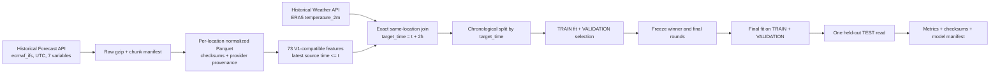
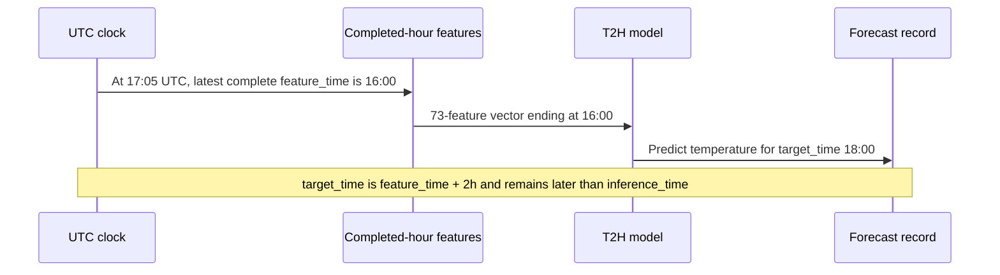

# Weather Forecast Modeling V1.1 — Historical-Forecast-Aligned T2H

## Model and source contract

This milestone creates a separate global model, `WEATHER_XGBOOST_GLOBAL_T2H_V1_1`, with feature contract `WEATHER_FORECAST_FE_T2H_V1_1`. It does not rename, overwrite, or reuse the frozen T1H model. The existing 73 model inputs and their V1 formulas are retained; their weather values are rebuilt from the new predictor product.

| Role | Provider product | Pinned selection | Meaning |
| --- | --- | --- | --- |
| Features | Open-Meteo Historical Forecast API | `ecmwf_ifs` (global ECMWF IFS HRES family) | Archived forecast-product inputs at valid time `t` |
| Target | Open-Meteo Historical Weather API | `era5`, `temperature_2m` | ERA5 reanalysis temperature at the exact same-location timestamp `t+2h`; a retrospective reference, not station truth |

The interval is inclusive `2020-01-01` through `2025-12-31`, UTC. Locations come only from the existing `NATIONWIDE_63` catalog. Contract B was selected: forecast-family-aligned predictors and an explicit ERA5 future reference. The target is joined by `(location_id, target_time)` with `target_time = feature_time + 2 hours`; there is no interpolation, nearest-time matching, row-offset assumption, or timestamp relabeling. Open-Meteo's current [Historical Forecast documentation](https://open-meteo.com/en/docs/historical-forecast-api) lists ECMWF IFS HRES from 2017-01-01; the 2020–2025 interval was also probed at its boundaries before acquisition. The selected [Historical Weather API](https://open-meteo.com/en/docs/historical-weather-api) supplies ERA5 reanalysis, which is a model-derived retrospective reference rather than station truth.

Historical Forecast responses do not expose row-level initialization time, run ID, or forecast lead. The resulting features are aligned to the forecast product and pinned model family, but they are not a reconstruction of values available at the original historical issue time. Open-Meteo model versions can also change over the six-year interval. On the 2026-10-03 probe, the generic Forecast API and explicit `ecmwf_ifs` returned identical coordinates and values for the 63 locations and seven variables tested. The generic response did not expose model identity, so that probe is current compatibility evidence, not a guarantee that future Best Match remains IFS. The downstream live request must pin `models=ecmwf_ifs` and prove offline/online feature parity.

## Temporal and feature semantics

All timestamps use UTC. Local calendar features use `Asia/Ho_Chi_Minh`. The model feature order is written to `feature_list.json`; its SHA-256 covers the canonical artifact including the new model and feature-set identities. The ordered list contains 73 numeric features. `weather_code` remains context metadata, as in V1, and is not an input column.

Current conditions, coordinates, calendar values, lags, rolling statistics, precipitation sums, and deltas preserve V1 definitions. Lags use exact positions on a validated UTC hourly index. Rolling windows are trailing, include `t`, require every hourly value in the window, and use population standard deviation (`ddof=0`). A missing timestamp or required numeric value is never filled, copied, or interpolated. Rows without the required 24-hour history or an exact `t+2h` target are excluded and counted.



The intended production timing is:



At wall-clock `17:05 UTC`, prediction for `18:00 UTC` has about 55 minutes of lead. The lead depends on when inference runs after the hour starts; it is not a fixed 55-minute property of the model. The next milestone should persist `forecast_lead_seconds = target_time - inference_time`, require it to be positive, and set a configurable minimum useful lead before treating a forecast as production-quality.

## Temporal split and test isolation

Rows are assigned from `target_time`, not `feature_time`:

- TRAIN: `target_time < 2024-01-01T00:00:00Z`
- VALIDATION: `2024-01-01T00:00:00Z <= target_time < 2025-01-01T00:00:00Z`
- TEST: `target_time >= 2025-01-01T00:00:00Z`

Past history may cross a split boundary because it was available by the later row's feature time. The offline materializer constructs all time partitions, including TEST, before training; it computes no TEST score. Candidate search and final fitting load TRAIN and VALIDATION only. Before freeze, the trainer checks TEST file checksums and Parquet footers without loading its row values. The winning parameters and round count are written to `freeze_manifest.json` before the trainer's single TEST partition load. Reload parity is checked on a VALIDATION sample first. The runner refuses to reopen TEST for a run whose freeze manifest already records that load or whose TEST metrics already exist.

The official baseline is two-hour persistence: prediction is `temperature_c(t)` and the target is ERA5 `temperature_2m(t+2h)`. Bias is mean(prediction minus target). Candidate selection is lowest full-VALIDATION MAE, with the documented deterministic tie breaks; no TEST statistic participates.

## Acquisition and run layout

Large provider responses and derived Parquet live outside Git under ignored `data/` paths. Small machine-readable run evidence is tracked under `results/modeling-t2h/20261003T070520Z-xgb-t2h-v1-1/`. The model JSON and full TEST prediction Parquet are preserved as local ignored copies and in Google Drive; their sizes, SHA-256 values, and external paths remain in the tracked manifests and checksum inventory.

```powershell
.\.venv\Scripts\python.exe -m historical.forecast_t2h_v1_1 `
  --data-root data\historical_forecast_t2h_v1_1 `
  --artifact-root results\modeling-t2h\20261003T070520Z-xgb-t2h-v1-1 `
  --start-date 2020-01-01 --end-date 2025-12-31 `
  --batch-size 10 --request-delay-seconds 30

.\.venv\Scripts\python.exe -m ml.forecast_t2h_v1_1 `
  --data-root data\historical_forecast_t2h_v1_1 `
  --dataset-root data\ml\weather_forecast_fe_t2h_v1_1 `
  --artifact-root results\modeling-t2h\20261003T070520Z-xgb-t2h-v1-1

.\.venv\Scripts\python.exe -m ml.train_forecast_t2h_v1_1 `
  --dataset-root data\ml\weather_forecast_fe_t2h_v1_1 `
  --artifact-root results\modeling-t2h\20261003T070520Z-xgb-t2h-v1-1
```

The downloader resumes valid checksummed chunks, records each request attempt and estimated provider call units, enforces rolling 600-unit/minute and 5,000-unit/hour windows, limits retries, honors `Retry-After`, waits 60 seconds after a 429 without that header, and stops before its configured 10,000-unit daily ceiling. Open-Meteo's [current free-tier limits](https://open-meteo.com/en/pricing) are 600 calls/minute, 5,000/hour, and 10,000/day; long ranges and variable counts contribute fractional call units. For safety, both rolling and daily guards count every attempted request, including rejected 429s and transport-ambiguous requests. The manifest separately records a local non-429 `charged` estimate; Open-Meteo does not return a billing receipt for this run. The 30-second inter-request delay is only a minimum; a quota wait is recorded in the manifest when either rolling window is full. If a daily ceiling defers any chunk, re-run the same command after quota reset; completed chunks are skipped.

For canonical Colab training, `notebooks/weather_forecast_xgboost_t2h_v1_1.ipynb` reads the validated dataset archives from Drive, checks their hashes and Parquet footers, extracts them to the Colab runtime, and writes run-specific evidence and large artifacts to Drive. It performs no Open-Meteo download and checks out the frozen protocol commit `28d6b569f7ba9a883ce294edde67ce746dc4ee67` before importing training code.

## Local preliminary run (not canonical)

The following local CUDA run is historical comparison evidence only. It is `LOCAL_PRELIMINARY`; it is not the canonical model artifact and does not satisfy the Colab execution gate.

The local acquisition completed all 84 chunks. Each source contains 3,314,304 hourly rows for 63 locations; validation found no missing hours, duplicate timestamps, nulls, or non-finite values. The materializer produced 3,312,666 eligible rows: 2,207,394 TRAIN, 553,392 VALIDATION, and 551,880 TEST, with all locations in each split and no non-finite model inputs or labels.

Five GPU candidates completed. `gpu_d8_regularized` won on VALIDATION MAE (0.664405 °C; RMSE 0.880144 °C; R² 0.964183). After refitting on TRAIN+VALIDATION for 1,024 rounds, the single TEST read scored 551,880 rows: MAE 0.655947 °C, RMSE 0.878358 °C, R² 0.963632, and bias +0.121831 °C. Two-hour persistence scored MAE 1.388160 °C and RMSE 1.792128 °C; the model lowered TEST MAE by 52.75%. The JSON model is 27,726,327 bytes (SHA-256 `bd5ee153b2709ac661557bdd11f8322b80de1264c65a27d1d6c79fbcf63ee66a`). Same-device CUDA reload parity passed on 25,000 VALIDATION rows with maximum prediction difference 0.0. The winner was frozen at `2026-10-03T09:01:22.627521Z`; TEST was first read once at `2026-10-03T09:10:54.714164Z`.

Quota accounting is a run limitation. The acquisition ledger contains 100 attempts totaling 10,818.7 estimated units, including 15 HTTP 429 responses (2,745.0 units); the local non-429 estimate is 8,073.7 units. The two-request live compatibility probe adds 6.3 estimated units. Open-Meteo's pricing page does not specify whether rejected 429 requests count against the daily cap, and no provider usage meter was available; if they count, estimated daily attempts exceeded 10,000 by 825.0 units including the probe. The pre-guard attempt ledger peaked at 9,791.6 estimated units in a rolling hour. After that was observed, the old downloader was stopped, rolling guards were added, and the remaining chunks were resumed only after sufficient quota expired. The data is complete and passes validation; the provider's final quota accounting remains unverified. See `provider_quota.json` and the request ledger for the per-attempt record.

## Candidate and runtime policy

The controlled family contains five GPU profiles or four CPU profiles based on the V1 candidate family. CPU adds one regularized, lower-learning-rate profile. XGBoost uses early stopping on VALIDATION; no candidate sees TEST. The final fit uses TRAIN+VALIDATION and exactly `best_iteration + 1` rounds. A small CUDA resource failure triggers the existing helper's CPU fallback and is recorded; the chosen parameter profile does not change. JSON reload parity compares both boosters on the final-fit device (CPU or CUDA) with a `1e-6` maximum-difference tolerance, avoiding backend-specific CPU/GPU prediction drift. The runtime manifest records Python, NumPy, pandas, PyArrow, XGBoost, scikit-learn, hardware detection, actual device, thread count, fit times, and fallback details.

## Evidence artifacts

The run directory contains the provider audit and source contract plus acquisition manifest, raw validation, feature list and contract, dataset and split validation, TRAIN-only feature statistics, persistence baseline, candidate records and winner selection, freeze record, final model manifest, reload parity, TEST metrics, per-location metrics, temporal diagnostics, runtime details, test report, and checksums. The full prediction Parquet and model JSON are external artifacts; the tracked checksum inventory classifies them separately from tracked evidence. Raw and normalized datasets are checksum-linked by source chunk ID.

The local run passed its modeling checks, but its status is `LOCAL_PRELIMINARY` pending canonical Colab execution. GitNexus did not resolve some T2H Python entry points; direct source inspection and the test suite provide supporting evidence. Source-vintage and conditional API quota accounting limitations remain part of the review. No merge or model tag has been created.

## Canonical Training Environment

Canonical Colab status: `CANONICAL_PASS` for run `20261003T122405Z-xgb-t2h-v1-1-colab`. The notebook checked out frozen protocol commit `28d6b569f7ba9a883ce294edde67ce746dc4ee67` on branch `model/weather-forecast-xgboost-t2h-v1` and trained on a Google Colab Tesla T4 GPU (Python 3.13.15, XGBoost 3.4.1 with CUDA). The transferred dataset passed identity checks: 3,312,666 rows (2,207,394 TRAIN, 553,392 VALIDATION, 551,880 TEST), 63 locations, 73 features, and feature-list SHA-256 `20a5d2fb56d9b7231f4c43b39ad7a833298d76b1bfd0f127b2b251c57e5d7fd2`.

All five frozen GPU candidates completed; `gpu_d8_regularized` won by full-VALIDATION MAE (0.664405 °C; RMSE 0.880144 °C; R² 0.964183), with best iteration 1023 and 1,024 final rounds. The winner was frozen at `2026-10-03T12:38:44.982055Z`; TEST was first read once at `2026-10-03T12:39:48.544428Z`. On 551,880 TEST rows, XGBoost scored MAE 0.655947 °C, RMSE 0.878358 °C, R² 0.963632, and bias +0.121831 °C. Two-hour persistence scored MAE 1.388160 °C, RMSE 1.792128 °C, R² 0.848603, and bias -0.687871 °C. XGBoost reduced MAE by 52.75% and RMSE by 50.99%, and beat persistence on MAE for all 63 locations.

The canonical model is 27,726,327 bytes with SHA-256 `bd5ee153b2709ac661557bdd11f8322b80de1264c65a27d1d6c79fbcf63ee66a`. Its SHA happens to match the local preliminary model; only the verified Colab GPU run is marked canonical. The JSON and full TEST predictions remain external in Google Drive at `/content/drive/MyDrive/weather-streaming-bigdata/artifacts/weather_forecast_xgboost_t2h_v1_1/20261003T122405Z-xgb-t2h-v1-1-colab/`; the tracked run evidence is `results/modeling-t2h/20261003T122405Z-xgb-t2h-v1-1-colab/`. CUDA reload parity passed on 25,000 VALIDATION rows with maximum difference 0.0 at tolerance `1e-6`; local-versus-Colab status is `CONSISTENT`.

Colab's PyArrow 23 single-file reader inferred a Hive partition column that conflicted with the stored `split` field. The notebook now applies a narrow compatibility wrapper for direct reads of individual Parquet partition files using `ParquetFile.read`; archive checksums, dataset identity, feature/target/split contracts, candidate selection, and model semantics are unchanged. This runtime-only adjustment was recorded in `parquet_read_compatibility.json` and `colab_environment.json`.

## Downstream operational SLO proposal

The next milestone is `Streaming Forecast Inference V1.1 — T2H`, followed by `Prospective Live Model Validation V1`. Proposed SLO for streaming inference: publish all 63 forecasts for `target_time = latest_completed_UTC_hour + 2h` within 60 seconds after the hour closes, with `target_time > inference_time`, 100% feature-contract parity, and no forecast emission when required hourly history is missing. This is a target for the next milestone and has not been measured by this offline modeling phase.
